# Causal Learning

*创建时间：2025-12-18*

*更新时间：2026-09-16*

## 基础概念

因果推断有三大假设，较难满足的是 SUTVA，要求样本影响独立、不会互相干扰；以及给定协变量后不存在未观测混杂；最后是干预概率为正。

因果推断（所有预测加最优决策方法）的一个核心问题是 OOD，最优化环节受到方差波动影响大。要么使用更多数据拉平每个预测组的方差，要么加上方差约束做鲁棒随机优化。RCT 数据昂贵，可以考虑加入 OBS 数据，再解决 OBS 数据的问题。

## 为什么要使用因果推断建模

1. 我们需要的是“施加Treatment"之后的”增量“效果，需要考虑不施加Treatment原本的样本的可能效果，因果推断用于计算增量

2. 非纯 RCT 数据，是否被施加Treatment本身也可能受到原本样本的selection bias或confounding影响，需要propensity纠偏

## 核心概念

- **ATE**：平均效果，不考虑 $x$，只考虑 Treatment，即 $E[Y(1)-Y(0)]$。

- **CATE/Uplift**：对一类人的效果，即 $E[Y(1)-Y(0)\mid X]$。

- **ITE**：对一个人的效果，即 $Y_i(1)-Y_i(0)$；无法直接求解，只能逼近，通常也是用 CATE 建模。

- **Elasticity**：建模连续效应，求剂量 $T$ 对效果 $Y$ 的偏导。

## 因果推断中的变量关系

<figure markdown="span">
  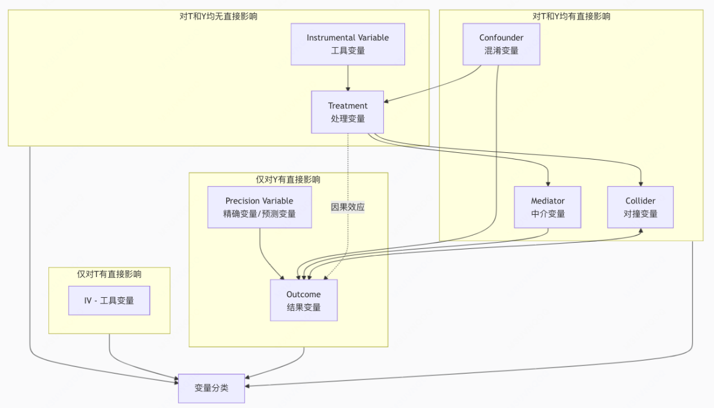{ loading=lazy }
  <figcaption>因果推断中的变量关系（图 1）</figcaption>
</figure>

这个图画的有点问题，仅对T影响 与 对T和Y均无影响写反了

4种变量：对T（是否施加治疗）有影响；对Y（实际结果）有影响；对T与Y都有影响（Confounder）；和对T和Y都无影响

## 模型评估指标

先定义四类人群：

给补-买，不给补-买

给补-不买，不给补-不买

**Uplift Curve**：前 $x\%$ Uplift 得分的人群中，给补中买的比例减去不给补中买的比例。

不在乎模型给了多少人补（给补数量不重要），只在乎 给补了一定会买，不给补一定不能买，**钱花的准**

回答的是：**“在哪个分段，我的补贴效率最高（钱花得最准）？”** —— 适合预算极其有限，必须精准打击的场景

**Qini Curve**：前 $x\%$ Uplift 得分的人群中，给补中买的人数减去不给补中买的人数（给补和不给补的采样总人数需要拉齐）。

不“太”在乎模型浪费了多少补（给补-不买的数量不重要，但不给补-买还是要看的），只在乎花钱带来的**绝对增量够不够大**

回答的是：**“切到哪个分段，我的营销活动能为公司带来最大的总GMV增量（规模最大）？”** —— 适合有一定预算，需要冲GMV或总用户净增量的场景

因果推断的策略效果评估方式可以参考强化学习page的off-policy的评估方法

## Meta-Learner

- **S-Learner**：单模型，根据输入T预估结果，简单

- **T-Learner**：多模型分别预估每个T的结果，受样本比例影响大

- **X-Learner**：base model预估结果，再用uplift model再估uplift，解决样本比例问题

- **R-Learner**：手动刨除base组效果（可能需要独立预估），以及默认进入base组的概率（需统计或独立预估），能够应付OBS数据；类似GRF的思路

- **DR-Learner**：$Y_i=\text{预估结果}+\frac{1}{\text{倾向概率}}(\text{观测真值}-\text{预估结果})$，直接对每个 $Y_i$ 训练；好处是一个预测得准就行，坏处是 Propensity 较小时方差大（与 R-Learner 类似），更依赖 Base 组模型。

## 因果森林

- **CART 树**：学习目标是最小化 $\sum(Y-\hat{Y})^2$，让同一叶子节点中的样本表现相似。

- **因果树**：学习目标仍可理解为最小化 $\sum(Y-\hat{Y})^2$，只不过 $Y$ 代表组内的 $T_1-T_0$。

- **因果森林**：一组因果树

### GRF

- 不仅可以预测Y，还可以预测各种问题；思路是把相似的样本划分在一起，然后局部加权反向求解预测值，让预测值与局部样本值尽量贴近
- 使用honest splitting来分别 划分结构 与 预估结果，比普通森林泛化性更好
- 他的叶子节点的核心预估值得出的公式是 min \\sum\_i i与x相似度 \* (i样本价值 - x预估值) ，反向求解x预估值，理解为x预估值要与所有跟他相似的节点尽可能相似，这叫做局部加权，可以更好拟合非线性；
- 相似度 通过两个样本在森林里落入同叶子的比例来计算

### GRF 因果森林

- 残差训练：全量数据训练多个xgb，cross-fitting估base值：m=f(x)，学过的数不预估自己的数；还要估每个样本propensity
- 节点分裂：每个节点按照让左右节点的概率加权y-m（多臂的话是个向量）最大而分裂
- 节点预估：每个树用另外一些数据来“计算”每个节点输出值（每个树自己做honest splitting分两波）。计算中要引入D-propensity来去掉样本倾向性影响

<figure markdown="span">
  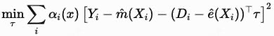{ loading=lazy }
  <figcaption>GRF 因果森林（图 2）</figcaption>
</figure>

理解：观测结果Y = 平均结果m + ( 出现行为的不常见程度 ) \* 行为收益t，越不常见越说明造成Y与m的差异

## 连续 Treatment 因果

- 核心内容是计算Y在每个Treatment附近的斜率；可以做单调性约束
- DML：估算平均线性slope
- GRF-continuous：假设局部用户slope呈一致线性
- DR-Net、VC-Net等：拟合非线性slope

## 深度模型

- cfr：学习t1，t0；让treatment与否的representation尽量一致，去除confounder影响
- Dr-cfr detangle-rebuild，把cfr的特征显示拆解成3部分 工具变量 混淆变量 预测变量，然后用工具与混淆预估是否接受，混淆与结果与treatment预估是否uplift影响。他还有些改进如min-drcfr通过loss里面加入变量间互信息最小化来继续解耦
- dragonnet：让模型能够预测出倾向性，认为confounder有助于提高表现。与早期cfrnet理念相反，有用的就要用
- efin：直接学习uplift与t0；同时让模型预估倾向性/分类，与dragonnet理念类似

## 具体模型介绍

### TAR(CFR)Net 2016

深度因果开山鼻祖

**模型结构：**

<figure markdown="span">
  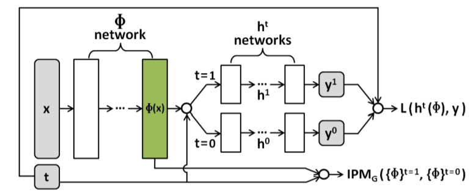{ loading=lazy }
  <figcaption>TAR(CFR)Net 2016 - 模型结构（图 3）</figcaption>
</figure>

**优化目标：**

<figure markdown="span">
  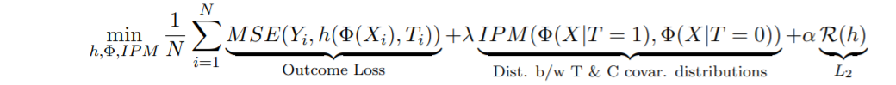{ loading=lazy }
  <figcaption>TAR(CFR)Net 2016 - 优化目标（图 4）</figcaption>
</figure>

**简介：**

共享representation layer，两个head各自预测treatment前后的结果

IPM模块用来收集隶属于treatment组数据的embedding与control组的表征，并要求两者分布一致，来让共享的表征层不要学习“由于confounder存在导致的数据偏置”带来的selection bias（如使用OBS观测数据，病情严重程度，对进入T组和C组本身有影响，对于治疗结果也有影响）

- 对于**纯randomized controlled trial(RCT)**下，可以视为不存在这种bias；但是其实采样多少都会有点儿，不过应该不严重就是了，具体有没有用要看消融了

### DragonNet 2019

**模型结构：**

<figure markdown="span">
  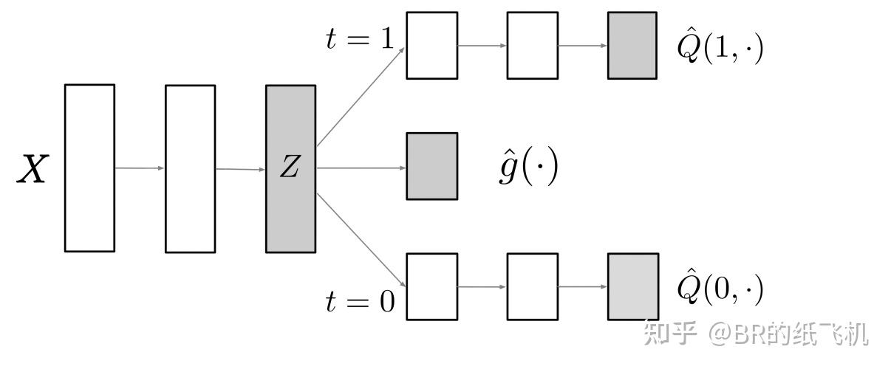{ loading=lazy }
  <figcaption>DragonNet 2019 - 模型结构（图 5）</figcaption>
</figure>

**优化目标：**

<figure markdown="span">
  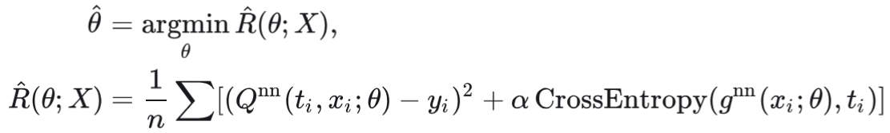{ loading=lazy }
  <figcaption>DragonNet 2019 - 优化目标（图 6）</figcaption>
</figure>

**简介：**

与CFR网络不同点在于，CFR希望通过强力拉齐representation layer的输出来让拉齐T组与C组，让confounder对采样本身带来的bias变小；而DragonNet则是认为，预测Treatment效果对uplift的表现 所需要的特征，完全等价于 预测样本是否愿意接受 treatment 的特征，既 仅保留 confounder与instrument variable，而不在意precision variable

所以，dragonnet有效的一个大前提是，**样本对是否进入treatment有明显的倾向性**

- 与CFR相同，纯RCT下因为不存在倾向性，DragonNet设计上意义不大，

#### 简化示例

对于定价冒泡的uplift预估任务，

treatment——给折扣A(treatment)，与不给折扣A(control)

result——呼叫（gmv），不呼叫（0）

CFRNet在这里的假设是，一些外部条件可能会影响我们给折扣或不给折扣的人群，这明显是错误的，不可用；

DragonNet在这里的假设是，预测result的特征，完全样本是否被给折扣的特征有关，这也是错的，不可用；

但如果换一种用法，让DragonNet的倾向性得分，预估用户在treatment下发单的倾向性...或许有用吧，但是与DragonNet本身的理论证明是不同的，需要自行验证（相当于多任务学习换辅助任务了，认为其他的任务有助于训练）

### FlexTENet 2021

**模型结构：**

<figure markdown="span">
  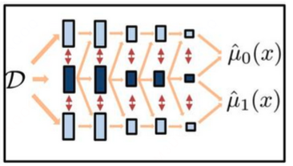{ loading=lazy }
  <figcaption>FlexTENet 2021 - 模型结构（图 7）</figcaption>
</figure>

**优化目标（损失函数）：**

<figure markdown="span">
  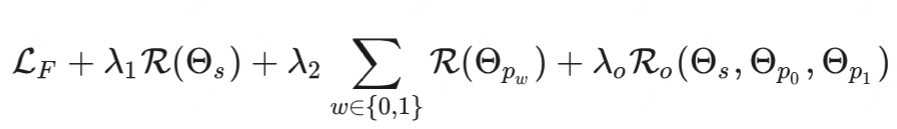{ loading=lazy }
  <figcaption>FlexTENet 2021 - 优化目标（损失函数）（图 8）</figcaption>
</figure>

**简介：**

非常直观暴力地的模型结构调优。中间加了一个shared subspace的head，用来学习两个不同private subspace的head的共享知识，并通过loss函数要求每个head与shared-head的参数要尽可能差异大。别的没啥可说的了

### SNet 2021（略）

**模型结构：**

<figure markdown="span">
  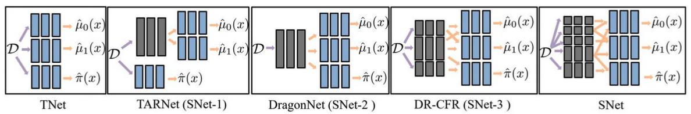{ loading=lazy }
  <figcaption>SNet 2021（略） - 模型结构（图 9）</figcaption>
</figure>

**优化目标：**

各个目标的加和

**简介：**

看着很暴力。就说这么多模型，用哪个结构更好呢？不如全融一起，平均性能会更好...纯灌水的感觉

### EUEN 2021

EUEN（Explicit Uplift Effect Network），专门用于广告/资源投放的场景设计的

**模型结构：**

<figure markdown="span">
  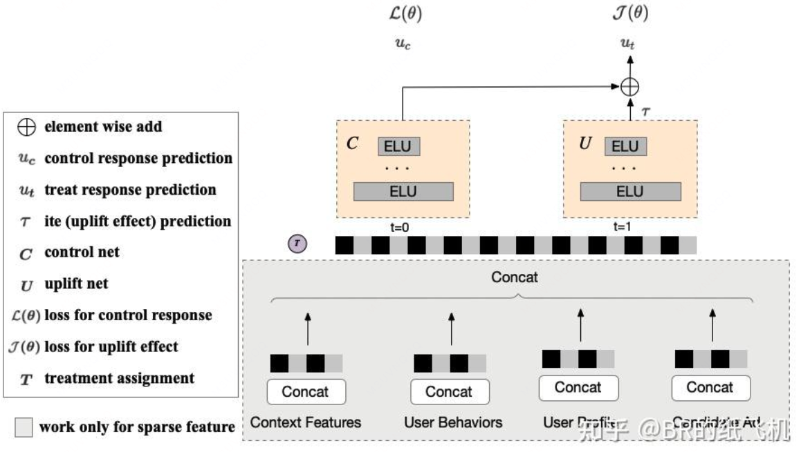{ loading=lazy }
  <figcaption>EUEN 2021 - 模型结构（图 10）</figcaption>
</figure>

**优化目标：**

<figure markdown="span">
  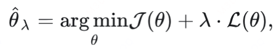{ loading=lazy }
  <figcaption>EUEN 2021 - 优化目标（图 11）</figcaption>
</figure>

J和L分别是给定Treatment与非Treatment的数据的预测与真值的差距

**简介：**

其实就是没有对数据debias的CFRNet，也有一丢丢ESMM的思路，利用全量数据来训练Uc和Ut，然后最终要的是算准uplift

### DRNet 2020

**模型结构：**

<figure markdown="span">
  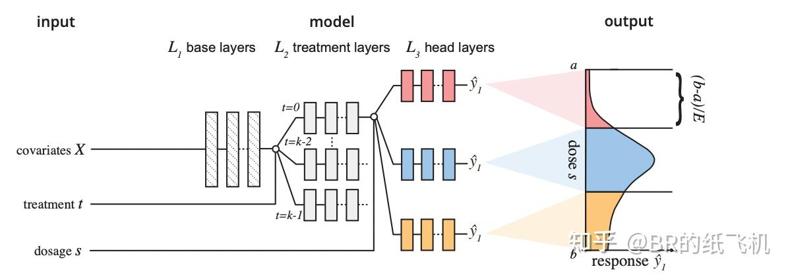{ loading=lazy }
  <figcaption>DRNet 2020 - 模型结构（图 12）</figcaption>
</figure>

**优化目标（损失函数）：**

<figure markdown="span">
  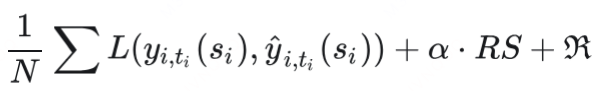{ loading=lazy }
  <figcaption>DRNet 2020 - 优化目标（损失函数）（图 13）</figcaption>
</figure>

**简介：**

面对treatment同时具有多种，并且还包含量化dosage的情况，要预估大量的counterfactual。方法也很暴力，一个shared-representataion layers，每个treatment对应一个head，每种treatment的每个dosage阶段也各自对应一个头，最终头的数量非常多

直接暴力学习，然后加了一个CFR的数据debias的RS约束（毕竟也是医学起源，还是需要数据纠偏的）

### VCNet 2021

**模型结构：**

<figure markdown="span">
  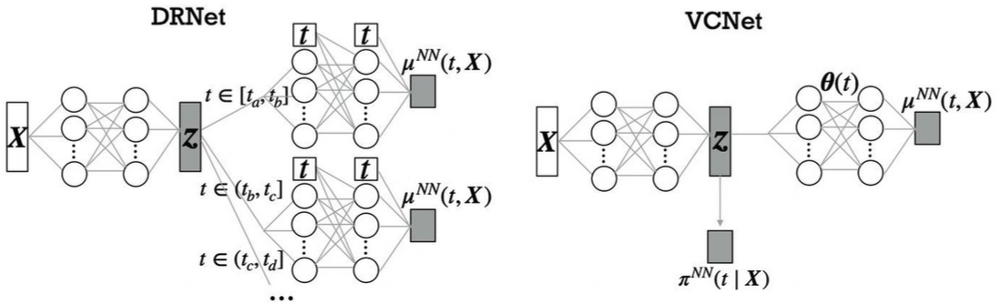{ loading=lazy }
  <figcaption>VCNet 2021 - 模型结构（图 14）</figcaption>
</figure>

**优化目标：**

<figure markdown="span">
  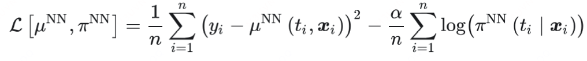{ loading=lazy }
  <figcaption>VCNet 2021 - 优化目标（图 15）</figcaption>
</figure>

前者是端到端loss，后者是负对数的倾向性得分

**简介：**

DRNet的暴力拆多头导致dosage的连续性成了问题。VCNet提出了一种“可变参数模型结构”，让所有的剂量头（其实是图中的t）全都捏在一个model里面。具体做法是，将表征层之后的predict head model通过“样条基变换”，通过公式构造一个自定义的f(t)来与predict head model相乘，对模型参数进行基于t的变化

此外还有一个类似DragonNet的倾向性得分头用来给特征提纯，但难点在于如何预估剂量的倾向性，其实就是做了个插值来算，也不是很重要..略过

### DECSN 2022 KDD

**模型结构：**

<figure markdown="span">
  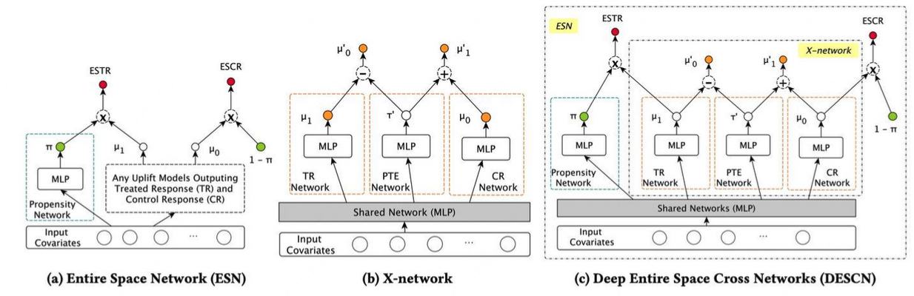{ loading=lazy }
  <figcaption>DECSN 2022 KDD - 模型结构（图 16）</figcaption>
</figure>

**优化目标：**

ESN：

<figure markdown="span">
  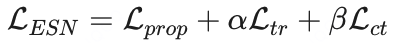{ loading=lazy }
  <figcaption>DECSN 2022 KDD - 优化目标（图 17）</figcaption>
</figure>

X-Net:

<figure markdown="span">
  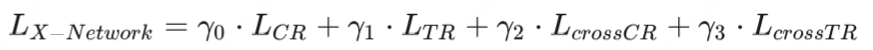{ loading=lazy }
  <figcaption>DECSN 2022 KDD - 优化目标（图 18）</figcaption>
</figure>

具体解释在简介中画了下划线

**简介：**

依然是面对OBS数据中，样本数据本身采样偏差、以及数量量级差异大的问题。其实对于长期在线运行的策略，这种OBS数据通常是更常见的，RCT数据是很珍贵的。

- ESN模块中也借鉴了一点ESMM的“全空间建模”思想，同时预测样本的倾向性prop，以及实验组和对照组的结果（prop\*val），来缓解数据量级差异的问题，同时也像DragonNet一样让模型表征层将特征聚焦在对T有影响的confounder上（不过这一点或许是次要的）
- X-network利用x-learner的思路，TR学习T组结果，CR学习C组结果，然后一个uplift模块PTE预测uplift，然后再让整体模型一起学习确保：CR预测的T组数据+uplift能够接近T，TR预测的C组数据-uplift能够接近C，来让模型完全利用数据进行学习并纠偏

介绍：x-learner：用control模型预测treatment组数据的control结果，treatment模型预测control组数据的treatment结果，然后再用俩模型来拟合这俩值与原本真值的差异，来减小样本空间偏差与数据偏差的问题

是个面向OBS的很不错的“技术”工作，理论、工作量、复杂度都很高，但是不好说会不会是技术PR\[狗头\]

### EFIN 2023 KDD

**模型结构：**

<figure markdown="span">
  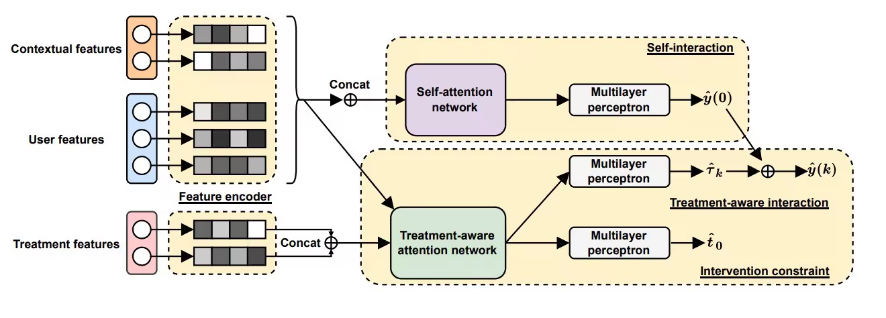{ loading=lazy }
  <figcaption>EFIN 2023 KDD - 模型结构（图 19）</figcaption>
</figure>

**优化目标：**

<figure markdown="span">
  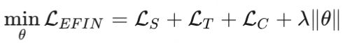{ loading=lazy }
  <figcaption>EFIN 2023 KDD - 优化目标（图 20）</figcaption>
</figure>

三个损失分别是native val；treatment val；对齐损失

**简介：**

面对的问题是 treatment特征利用以及特征交互利用不充分，所以主要工作在于特征embedding建设与交叉

稀疏特征使用lookup来取得并训练embedding；self-attention不做赘述；treatment-aware attention的Q是treatment features，KV是基础features；intervention做了用于面对OBS数据差异的t与c的磨平

### RERUM 2024 KDD

**模型结构：**

<figure markdown="span">
  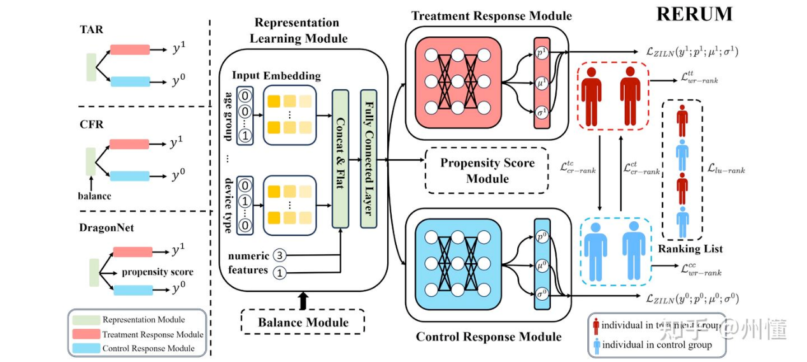{ loading=lazy }
  <figcaption>RERUM 2024 KDD - 模型结构（图 21）</figcaption>
</figure>

**优化目标：**

<figure markdown="span">
  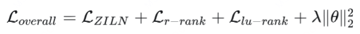{ loading=lazy }
  <figcaption>RERUM 2024 KDD - 优化目标（图 22）</figcaption>
</figure>

T和C各自的准确率，4个pair排序损失，一个list排序损失

**简介：**

需要假设**数据为RCT数据**；

面向连续性收益Outcome具有长尾分布效应难以处理的问题，以及更注重高响应值用户、忽略低响应值用户的问题。主要做了一系列损失函数的改进，没有新的模型结构设计；

对于这俩问题，由于MSE对异常值非常敏感，容易被海量的0值冲垮，所以C和T的准确性损失函数使用ZILN loss替代MSE；

把uplift问题当做排序问题来处理，设计了大量的排序类优化目标：

- 基于样本对的组内保序(c对c，t对t)：任取（实际上取有限个即可）两个实验组或对照组的样本，真值更高的那个样本，预估值必须也更高 —— 这个目标很好，有助于模型训准
- 基于样本对的组间保序(c对t，t对c)：任取一对实验组&对照组的样本，t值差(c组数据估值-t组数据真值)与c值差(c组数据真值-t组数据估值)要尽量同向，直观来说，两个跨组数据，control值越高的那个，treatment值也要越高 —— 这个目标感觉可能会有点小问题，就是c真值高的样本，t估值不一定就必须要高，可能就没什么弹性呢；或许是作为个正则使用吧
- 基于list的排序：作者做了一个真实uplift的分数列表（略复杂，强要求RCT数据，用其他组的数据真值估算本组用户的估值），然后让每个batch内数据的预估的uplift排序概率与真实uplift排序保序
- 总体来说，2和3这部分的优化目标的假设感觉有点绝对，不一定适合所有的问题；ZILN loss和组内保序还是值得借鉴的

介绍：ZILN loss = Cross Entropy + alpha \* lognorm（x; μ, σ)

是谷歌2019年用于LTV设计的预估模型与优化方法，模型输出三个值p,μ,σ；p预估价值不为0的概率，u和σ是对数正态分布的均值和方差，用来预估非0部分数据的分布情况，可以用极大似然估计让x尽量服从u和σ构成的分布。

为什么使用对数正态分布？从直观来理解的话，参考log函数图像，对数函数通过让0~1之间的y值快速变化，让1~INF之间的数慢速累积，最终让log符合正态分布的形式，取得一种可以描述右偏长尾数据的分布

<figure markdown="span">
  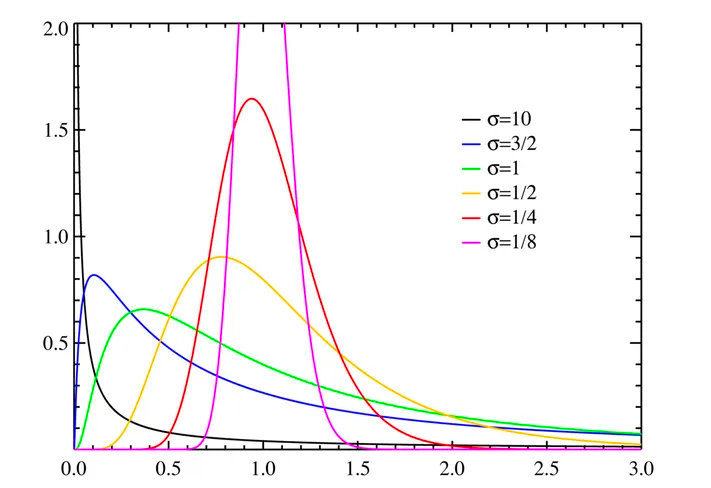{ loading=lazy }
  <figcaption>RERUM 2024 KDD - 简介（图 23）</figcaption>
</figure>

### UMLC 2025 KDD

**模型结构：**

<figure markdown="span">
  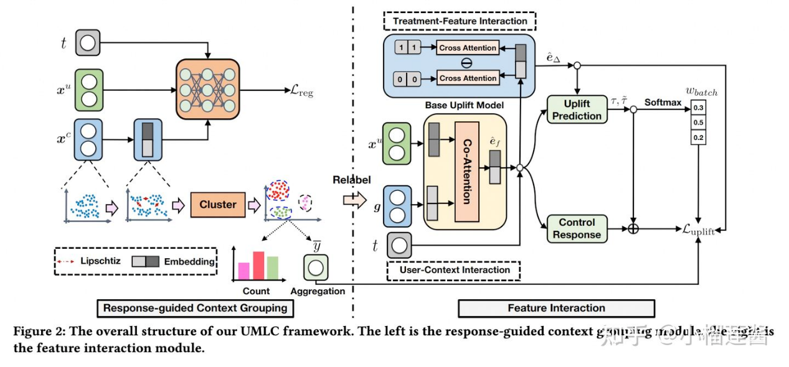{ loading=lazy }
  <figcaption>UMLC 2025 KDD - 模型结构（图 24）</figcaption>
</figure>

**优化目标：**

Lreg = response回归mse loss + 1e-4 \* LupschitzRegression的模型正则

这里的response就是control组数据的真实结果值

<figure markdown="span">
  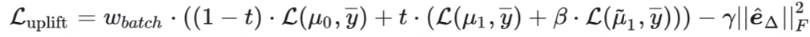{ loading=lazy }
  <figcaption>UMLC 2025 KDD - 优化目标（图 25）</figcaption>
</figure>

wbatch是该组中 使用treatment变量attention的结果e的预测结果 与 不用e的预测结果的差，这个差越大，越重点学习

μ0是通过ef直接control预测，μ1是通过ef直接treatment增量预测，~μ1~是通过ef加e的增量预测，最后的e注意力加权的值、用于放大treatment变量影响

**简介：**

面对 在使用RCT数据时，原始的“上下文类特征”可能会导致T组与C组的数据分布偏移 的问题

首先，通过训练让一个回归模型预估control组数据的真实response的方式，来训练把context降维的能力，**让模型学习到上下文中与response高度相关、而非与treatment相关的特征（可以理解为去除confounder对treatment的影响）**；然后利用低维度特征进行K聚类，每个context特征会对应某个类g；之后对数据再做整合，把用户特征、g、treatment相同的数据进行合并，新的数据的y = (yi + yj)/2。通过这种给context降维聚类的方法，来一定程度降低不同context特征与T组C组数据的潜在联系

其次，设计了一个交互模型，输入是用户特征emb，context分组的emb，以及treatment变量。里面有两个交互模块，分别是user-context的co-attention模块（输出位ef），以及treatment的交互模块的cross-attention(treatment特征是Q，输出为e)，进行最后的uplift结果预估。这里面最后做了三个预测，分别是使用ef预测control结果，使用ef预测treatment结果，以及使用ef&e预测treatment结果。这个位置较神奇，不是很好理解，引用AI讲解了：

这就像有两个侦探调查同一个案件：

侦探A（uplift\_base）：只能查看案发现场（用户-上下文）

侦探B（uplift\_full）：还能查看凶手留下的线索（treatment）

如果两人得出相同结论，说明线索（treatment）可能不重要

如果结论不同，说明线索（treatment）是关键证据

案件真相（uplift\_true） 是评判标准，迫使两人协作找出真正原因

- 让模型通过用context特征拟合control组响应来学习context特征的思路蛮有趣的，降低context这种非完全RCT数据的对treatment的耦合，提高模型效果
- 各种注意力模块的应用，应该是基操了

## DFL 与 DFCL

[\[2407.13664\] Decision Focused Causal Learning for Direct Counterfactual Marketing Optimization](https://arxiv.org/abs/2407.13664)

Two-Stage的问题是：1）模型优化目标是MSE，但实际重要的是序准，误差小但顺序可能会错；2）多个模型组合各学各的，但整体决策不一定最好；3）优化阶段放大模型误差问题

一般CL: x -> y=f(x) -> argmax\_z F(y) -> 业务收益

DFL：将业务收益直接用作训练f(x)

DFL的核心问题是，通过argmax（ILP）选出的如何求导；

DFCL在此基础上，加上两个新问题，counterfactual不可知 与 ILP每轮求解成本高

- 问题1——argmax不可导
    - policy learning loss：使用 “softmax计算所有action的概率” 来替代 “argmax选择最优action”，p(j | x) = exp(GMVj + lambda \* Profitj) / sum exp(GMV + lambda \* Profit)
- 问题2——counterfactual不可知
    - inverse propensity weight(IPS、IPW)：对内部进行放大 1 / P(j/x) \* r\_j
- 问题3——ILP每轮求解成本高
    - 直接使用dual decomposition来简化ilp问题

提出了一种训练范式：

通过因果模型估r和c的uplift，然后代入线性OR来计算各act的softmax，然后通过IPS评估结果作为真实reward反向训练因果模型，同时也保留原始r与c的目标值让模型来学习

## 参考资料

- [https://zhuanlan.zhihu.com/p/627344224](https://zhuanlan.zhihu.com/p/627344224)
- [https://zhuanlan.zhihu.com/p/49306740651](https://zhuanlan.zhihu.com/p/49306740651)
- [https://zhuanlan.zhihu.com/p/12800803045](https://zhuanlan.zhihu.com/p/12800803045)
