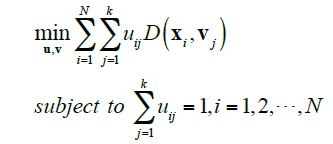
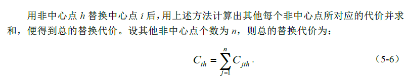
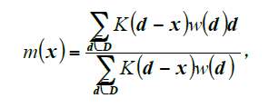
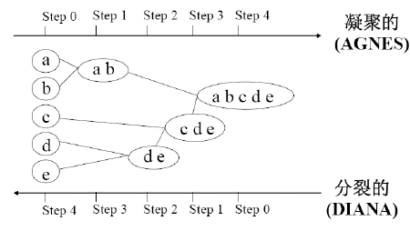
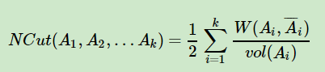
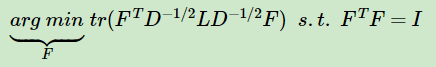
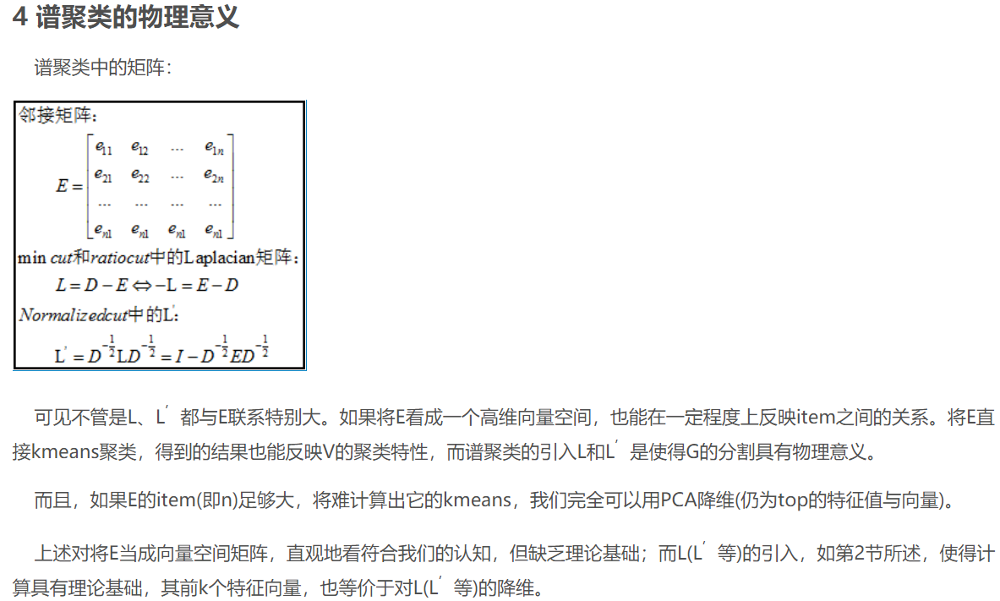

# Cluster

*创建时间：2018-12-26*

## 1 划分聚类

将数据划分成子集。一般计算量大

### 1.1 K-means

**优化目标：**

<figure markdown="span">
  { loading=lazy }
  <figcaption>K-means 聚类优化目标</figcaption>
</figure>

-   **优点**

    保证收敛到局部最优，实现简单

-   **局限**

    受初始值影响，不能全局最优；均值容易受到噪点影响

#### 1.1.1 模糊k-means

采取**软策略**，算法更灵活

#### 1.1.2 ISODATA

迭代自组织数据分析，在k-means基础上自动调成k数值

通过删除过小簇、分裂过大簇、合并过近簇实现

### 1.2 k-中心点聚类  PAM算法

类似均值，只不过通过中心点来代表簇，而不是均值

通过计算每一个点的**替换代价**来实现

<figure markdown="span">
  { loading=lazy }
  <figcaption>PAM 替换代价</figcaption>
</figure>

-   **优点**

    不易受到噪声影响

-   **局限**

    计算复杂度更高，面对大数据计算效率低

#### 1.2.1 CLARA算法

通过抽样得到小样本进行K-中心点聚类，而后对整个数据集按距离分配

#### 1.2.2 CLARANS算法

利用图的思想，将聚类问题理解为 在N个数据点中找出最优的k个中心点 。每一种中心点设定方式作为图中一个节点，所有的选取方式作为一个图（此处太大了，似乎有想法）。两个节点图若只有一个中心点不同，则相连。于是变为搜索图中最优节点的问题。

一开始随机选一个点，然后评价相邻点聚类质量，不断转化找到局部最优。

### 1.3 Mean Shift均值迁移

给定一组中心点，不断迁移每个中心点为当前邻域均值，并继续迭代更新这个中心点的均值进而计算新的中心点的数值。

邻域均值计算公式：

<figure markdown="span">
  { loading=lazy }
  <figcaption>Mean Shift 邻域均值计算公式</figcaption>
</figure>

K是一个单变量核函数，用以表达数据邻域（就是用来表示这个数据算不算我的邻域）；d是单个数据，w是数据点的权值

## 2 层次聚类

逐步分层聚类，分为bottom-up凝聚层次与up-down分裂层次。一般来说，计算量比划分聚类小一些

<figure markdown="span">
  { loading=lazy }
  <figcaption>凝聚与分裂层次聚类</figcaption>
</figure>

### 2.1 BIRCH

利用层次方法的平衡迭代规约和聚类（Balanced Iterative Reducing and Clustering Using Hierarchies）

??? info "延伸阅读"

    [BIRCH 聚类算法原理](https://www.cnblogs.com/pinard/p/6179132.html)

通过一种 CF（Cluster Feature，有线性特性，可简单相加）来构建一种 CF Tree，特点类似于 B+ 树。最后，**CF 树的每一个节点（一般来说）都可以是一个聚类的簇**。

**优点：** 省内存；速度快，只需要**单遍**扫描数据；可识别噪点。可以不给出 K 值，适用于类别数、样本量比较大的情况。

**缺点：** 节点限制人工给定，可能与自然分类不服；高维特征处理不好；非凸问题处理不好

### 2.2 CURE

面对其他聚类方法偏好解决球形数据的问题，CURE提出了利用**多个代表点**来模拟其他形状的方法。

采用抽样技术先对数据集D随机抽取样本，再采用分区技术对抽出样本进行分区，然后对每个分区局部层次聚类，最后对局部聚类进行全局聚类

特点：簇形状模拟好；对孤立点处理效果好

### 2.3 CHAMELEON

用图的思想来进行聚类。

取得数据稀疏图，通过一些简单的方法（原为图割）做成很多小的簇。其中图割的优化目标是使得被切掉的边权值最小化。最后利用相对紧密度与相互连接性两个指标，对簇之间的关系进行衡量；根据两个指标对小簇不断进行融合聚类成大簇。

特点：适合高维度聚类，形状好

## 3 基于密度的方法

根据数据的密度进行聚类。关键在于对于密度的定义。只要密度满足要求就会不断生长。

形状比较好

### 3.1 DBSCAN

密度定义的参数：邻域的最大半径和邻域内最小数据点数

循环处理所有数据点，判断该点为中心，邻域是否足够密集，从而属于核心点，或属于局外点。把所有相关的点标记为同一个簇。

??? info "延伸阅读"

    [DBSCAN 密度聚类算法](https://www.cnblogs.com/pinard/p/6208966.html)

特点：适合任意形状的稠密聚类

### 3.2 DENCLUE

密度定义：影响函数的大小表示密度，影响函数取决于两个点之间的距离。越远越小。一个点的密度通过通过其与邻域的影响函数之和来表达。

有两种，一种中心定义的簇；一种任意形状簇。

具体操作是按照密度吸引（密度值从大到小排列，表示吸引）

### 3.3 基于密度峰值

依据密度来寻找最合适的数据中心点。

密度定义：一个点周围小于一定半径的点的个数

中心点的定义：相对于邻域点，有较高数据密度；与其他密度高于自己的点距离很远。

通过点的密度a以及高于该点密度的点的距离b，这两个参数较大的情况来选择聚类中心点。

特点：计算快，可用于大数据、高维数据；自动选k；形状好

## 4 基于网格空间的方法

从数据空间的角度进行聚类。计算复杂度对数据规模影响不敏感，可伸缩性好。

### 4.1 STING

统计信息网格方法

把数据投射在最底层网格上；上面每一层的粒度都更大一些。每一层都是一个聚类结果。

??? quote "随手记"

    WTF…这就完事了…

### 4.2 CLIQUE

查询中聚类

在数据空间的各个**子空间上**寻找密度高的区域来进行聚类。形状好。

### 4.3 WaveCluster

利用小波变换将数据在变换空间上进行聚类。

可以去噪声，但效率很低，受维度影响

## 5 基于统计模型方法

利用统计分布计算条件概率等来聚类。

### 5.1 GMMCluster

假设数据服从高斯混合模型（GMM），每个高斯分布一个簇。

### 5.2 AutoClass

假设模型服从有线混合模型。

## 6 基于图的方法

### 6.1 Spectral Clustering 谱聚类

思想就是图割，把所有点联系在一起想办法切分为子图，子图内部边权之和尽量大，切掉的边权尽量小。

NCut：最小化切掉的边权并最大化每个图的子点的度的和。（与最简单的切图相比，防止只切边缘小点）

<figure markdown="span">
  { loading=lazy }
  <figcaption>NCut 优化目标</figcaption>
</figure>

优化目标最终转化为：

<figure markdown="span">
  { loading=lazy }
  <figcaption>谱聚类松弛后的优化目标</figcaption>
</figure>

即求一个L的谱分解

最后选取前k个F中的特征向量，并采用其他的聚类方式对这k个向量聚类成k2… …这就是聚类结果

也就是说，谱聚类把原始邻接矩阵用特征矩阵进行降维，然后用更好计算kmeans的特征矩阵来进行聚类，代替原始的问题

??? note "谱聚类的物理意义"

    <figure markdown="span">
      { loading=lazy }
      <figcaption>谱聚类的物理意义</figcaption>
    </figure>

??? info "延伸阅读"

    [谱聚类原理总结](https://www.cnblogs.com/pinard/p/6221564.html)

特点适应性好，聚类效果优秀，但是维度大计算会很慢

## 7 递增聚类方法

应对高速变化的网络数据时代，新的数据在已有聚类结果的基础上继续进行聚类。
