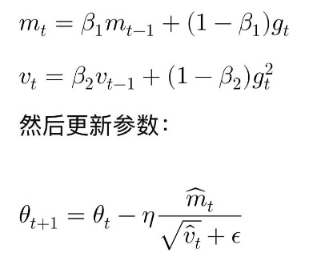

# [经验]深度学习基础与 Trick

*创建时间：2023-09-01*

*更新时间：2026-09-12*

## Norm 层

- 控制分布一致，避免梯度进入饱和区域而消失，并加速训练。深度网络的一个假设是数据独立同分布，训练才会更稳定。
- 为了让每一层的输出数据维持在类似的分布，避免深层需要反复适配浅层的分布，先进行标准化：

    $$
    \hat{x}=\frac{x-\mu}{\sqrt{\sigma^2+\epsilon}}
    $$

- 同时又不能让浅层神经元的输出完全无用功，因此再加上可学习的缩放与偏置：

    $$
    y=\gamma\hat{x}+\beta
    $$

- **Batch Normalization**：每个神经元配一组参数，均值和方差来源于一个 batch 中的全部数据。
    - 对每个神经元的输出，计算整个 batch 在该神经元上的均值与方差并标准化。适合 mini-batch 较大、数据分布一致的情况。
- **Layer Normalization**：一层神经元共享一组归一化过程，均值和方差来源于一个样本在该层的输出。
    - 对一个样本在该层各维度的数据计算均值与方差，不依赖 mini-batch 大小，适合变长数据，也不会受到其他样本影响。

## Cross Entropy

二分类交叉熵为：

$$
L=-\frac{1}{N}\sum_{i=1}^{N}\left[y_i\log\sigma(z_i)+(1-y_i)\log\left(1-\sigma(z_i)\right)\right]
$$

- 与 Sigmoid 结合后，对每个 logit 的导数为：

    $$
    \frac{\partial L}{\partial z_i}=\frac{\sigma(z_i)-y_i}{N}
    $$

- MSE 结合 Sigmoid 时，在两端容易进入饱和状态，导致难以学习。
- 交叉熵结合 Sigmoid 是凸的，而 MSE 结合 Sigmoid 非凸。
- 信息熵 $H(X)=-\sum_x p(x)\log p(x)$，意义是衡量编码确定信息所需的空间；$p(x)$ 越大，单个事件的信息量越小。
- 交叉熵的意义是使用预估分布表达真实分布所需的平均编码长度。
- KL 散度 = 交叉熵 - 信息熵。

## Softmax 与 Sigmoid

两者都会把数据映射到 $0\sim1$。

- **Softmax**：对一组数据按相对大小进行归一化，强调一组数据中的相对重要性。

    $$
    \operatorname{softmax}(z_i)=\frac{e^{z_i}}{\sum_j e^{z_j}}
    $$

    实现时通常减去最大 logit，并使用 log-sum-exp 技巧来避免数值上溢。

- **Sigmoid**：对单个数据进行归一化，强调单个信号的强弱。

    $$
    \sigma(x)=\frac{1}{1+e^{-x}}
    $$

## Adam 优化器

Adam 按下图所示的过程调整梯度：

<figure markdown="span">
  { loading=lazy }
  <figcaption>Adam 优化器的梯度调整过程</figcaption>
</figure>

- $m$ 提供动量，保持学习稳定。
- $v$ 控制幅度，将较大的梯度缩小、较小的梯度放大。
- AdamW 在梯度更新阶段加入权重衰减。
    - 理念上类似 L2 正则，但不会让正则项影响 Adam 的 $m$ 和 $v$。

## 梯度消失与梯度爆炸

常见处理方法包括 ReLU/GELU、残差连接、LayerNorm/RMSNorm、合理初始化、AdamW 和梯度裁剪等。

## 训练数据与真实数据的 Selection Bias

- 可联系 PPO 中的 IS，以及因果推断中的 IPS/IPW 理解。
- 如果数据样本明确有偏，可对 loss 使用下式加权，把数据恢复到预期分布：

    $$
    w=\frac{p(\text{预期出现})}{p(\text{真实采样})}
    $$

    例如，一个样本只以 20% 的概率被采样，但正常应该 100% 出现，可以加权 5 倍。

- 如果历史数据比例无法复原，可以考虑使用 XGBoost、LightGBM 等模型预估 IPS。
- IPS 的问题在于方差可能非常大，需要进行 clip 等处理。
    - 一般可限制 $w\leq20$。

## 基础计算与参数量估算

### 词表 Embedding

可以直接理解为 `one_hot(x) @ embedding`，矩阵乘法可导。

### 矩阵乘法复杂度

设形状为 $a\times b$ 的矩阵与形状为 $b\times c$ 的矩阵相乘，则复杂度为 $O(abc)$。

### 推荐系统 Vocab 参数量估算

Vocab 大小开四次方后取近似值作为 embedding size。例如，一千万规模的 Vocab 可以采用 32～64 的 embedding size。NLP 任务不能这样估算，可参考 2 万 Vocab 配 256 维、5 万 Vocab 配 512 维。

总参数量约为 `vocab × embedding_size`。不同精度占用不同：FP32 每个参数占用 4 Byte（32 bit）。

- 参数、梯度和 Adam 优化器状态通常需要先放大 3～4 倍估算。
- 还需保存中间激活值，大小接近每层模型的输出。如果是 Transformer 类模型，还要再增加；词表 Embedding 层的激活值通常很小，可以忽略。

例如：

- 推荐系统词表可按 `vocab × embedding_size × 4 Byte × 4` 粗略估算。一千万规模的数据在 FP32 下约为 1B 参数，需要约 16 GB 训练显存。
- Transformer 类模型中，1B 个 FP32 参数本身约占 4 GB，总训练显存可粗略估算为 32 GB。

模型参数可以考虑使用 FP16 或 BF16 进行混合精度训练，以加快速度并节省参数与激活值的显存；但可能需要保留一份 FP32 主参数副本。也可以使用梯度检查点，只记录部分激活值，其余在反向传播时重新计算。

### PyTorch AMP（混合精度训练）

- **精度格式**：硬件支持 BF16 时优先使用，否则使用 FP16 + GradScaler。FP16 精度较高，BF16 的数值范围与 FP32 相近。
- **Autocast**：自动管理精度切换，大多数情况下无需手动干预。
- **GradScaler**：仅 FP16 需要，通过动态缩放防止梯度下溢。
- **裁剪顺序**：`unscale → clip → step → update`。
- **组合优化**：AMP 可与 `torch.compile`、分布式训练结合。

## 提点 Trick

### 样本调整

- 负样本采样，难负例保留。

### 模型调整

- 到处补 Dropout。
- 到处加 Normalization。
- 到处加 SE Layer。
- ReLU 换成 LeakyReLU、PReLU、SiLU 或 SwiGLU。
- 无脑多头。
- Gating，例如自 Gating：$y=\operatorname{sigmoid}(Wx)x$。
- 通过 AE 进行特征重建，增强 feature 的鲁棒性。
- 给 Pooling、Resize 等非参数层替换为可学习参数。
- 酌情增加 Shortcut。

### 超参调整

- Batch Size 与 Learning Rate 同步调整。
- 学习率使用 Warmup + Cosine Decay。

### Loss 调整

- Label Smoothing。
- Hinge Loss。
- 加入对比学习、Triplet Loss 等优化表征。
- 增量 Loss，通过相加的形式增加损失函数。
