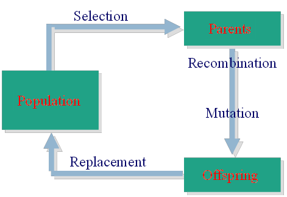
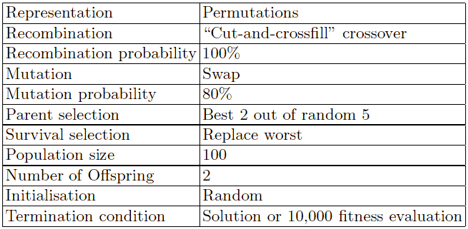
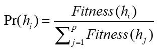
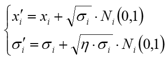
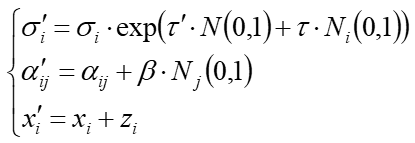

# Evolution computation

*创建时间：2019-01-07*

## 主体思想

- 通过遗传来增加解答多样性：突变、重组
- 通过选择来减少解答多样性：父母、幸存者

## 进化循环

<figure markdown="span">
  { loading=lazy }
  <figcaption>进化计算循环</figcaption>
</figure>

### 要素 1 Representations

- **基因表现 Genotypic**：Encode 表现 → 基因、Decode 基因 → 表现
- **表现表示 Phenotypic**：特定问题编码

### 要素 2 Evaluation Function

- 表达了 population 需要满足的条件
- quality 函数或 objective 函数

### 要素 3 Genetic Operators

- to generate new candidate solutions
- 通常包括 **mutation**（1 parent）、**recombination**（2 parents）
- **mutation** to introduce new information
- **recombination** to combine information form parents

### 要素 4 Parent Selection

- 优秀优先，随机遗传
- 趋向于正确的有更高的成为 parent 的概率
- 但差的也可以

### Survivor Selection

- **Fitness based**：程度上合适的留下
- **Age based**：老的去死

遗传与选择要有一个平衡。遗传用来探寻更远的地方，可能导致不收敛；选择用来留下好的个体，可能导致局部最优。

强选择配合高突变率；弱选择配合低突变率。

### 要素 5 Initialisation/Termination

随机初始化；终止每一轮都检查一下看行不行。

## 简单实例——八皇后

- **问题表达**：12345678 一串数字
- **评价函数**：所有王后可以互相吃到的次数，越低越好
- **突变**：随机交换两个位置
- **重组**：80%，选择一个位置，两个结果交换序列拼接，就像 DNA 交叉互换一样
- **父母选择**：100%，选择随机 5 个里面最好的 2 个
- **生存选择**：保持人口数量限定在一个程度，新来的会地换掉比最差的一个
- **初始化**：random
- **终止**：10000 次或解决

<figure markdown="span">
  { loading=lazy }
  <figcaption>八皇后进化算法参数</figcaption>
</figure>

## 进化计算特点

- **优点**：适合解决各种问题，不需要对凸、连续等性质做假设，相对噪声不敏感，易于并行计算
- **缺点**：有限时间内不能保证最优；理论薄弱；需要调参

## 进化算法

### 1 Genetic algorithms (GA, SGA)

- **Representation**：Genome
- **Selection**：Greedy，选最合适的方案们。选择概率表达如下

<figure markdown="span">
  { loading=lazy }
  <figcaption>适应度比例选择概率</figcaption>
</figure>

- **Crossover**：Same to 交叉互换遗传
- **Mutation**：在（1/总人口，1/基因长度）直接变换

### 2 Evolution Programming (EP)

- **Representation**：用于连续参数优化，由两部分组成，变量 x 与突变步长
- **Mutation**：变量根据对应的突变步长突变；突变步长自身也在突变

<figure markdown="span">
  { loading=lazy }
  <figcaption>变量与突变步长更新</figcaption>
</figure>

- **Recombination**：**None**
- **Parent Selection**：自身突变
- **Survivor Selection**：两两循环赛 Competitions in round-robin

### 3 Evolution Strategies

- **Representation**：变量，策略参数，包括突变步长与旋转角
- **Mutation**：简单理解吧……参数也在变，变量也在变

<figure markdown="span">
  { loading=lazy }
  <figcaption>策略参数与变量更新</figcaption>
</figure>

- **Recombination**：两条链分别都要交叉，从父母位置选择均值或者随机选择一个
- **Parents Selection**：随机分布？取得
- **Survivor Selection**：差不多吧
