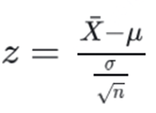
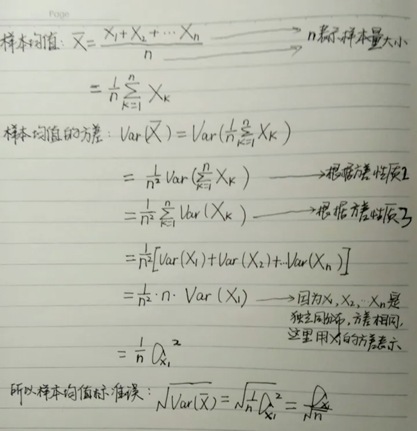
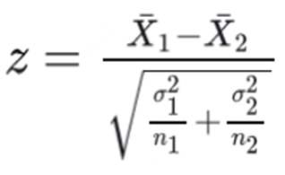
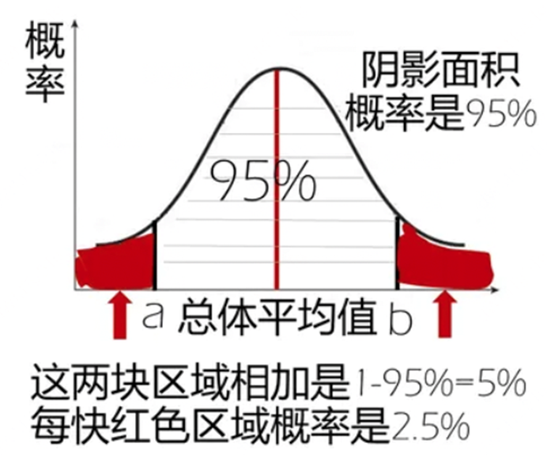
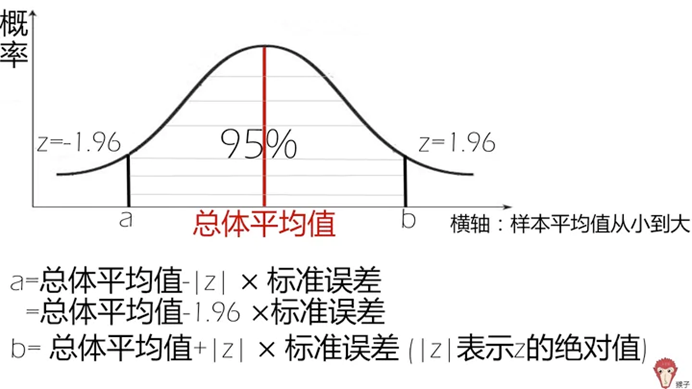

# [经验]假设检验核心理解

*创建时间：2023-04-02*

*更新时间：2026-09-12*

## 不考虑协变量影响

### Z 检验

不考虑协方差时，假设检验使用 Z 检验或 T 检验。其中，总体标准差未知时通常使用 T 检验，Z 检验要求大样本（至少大于 30）。

Z 检验统计量计算公式（单样本组检查）：

<figure markdown="span">
  { loading=lazy }
  <figcaption>单样本 Z 检验统计量</figcaption>
</figure>

其中，$X$ 为样本均值，$\mu$ 为总体均值（或检验目标值），$\sigma$ 为总体标准差（可用样本标准差 $S$ 替代），$n$ 为样本容量。

当 $|z| > 1.96$ 时，认为存在显著差异（95%），表示反复抽样构造的区间中，约 95% 会覆盖固定的真实参数。

理解：

- $x$ 与 $\mu$ 越远，越显著。
- 总体标准差 $\sigma$ 越大，越不显著，因为样本本身波动就大。
- $n$ 越大，**样本标准误**越小，即通过样本标准差估计的总体标准差越小，越显著。
    - 标准误 = 标准差 / $\sqrt{n}$。
    - 标准差是“样本内部的离散程度”，标准误指的是“样本均值在整体中的离散程度”。
    - 直观理解为采样样本越大，标准误越小。

<figure markdown="span">
  { loading=lazy }
  <figcaption>标准差与标准误示意</figcaption>
</figure>

双样本 Z 检验公式：

<figure markdown="span">
  { loading=lazy }
  <figcaption>双样本 Z 检验统计量</figcaption>
</figure>

显著的意义是：假设总体服从正态分布 $N(\mu,\sigma)$，如果样本均值落在该分布左右两侧各 2.5% 的累计概率值区间内，则认为两者具有显著差异。

<figure markdown="span">
  { loading=lazy }
  <figcaption>双侧检验的拒绝域</figcaption>
</figure>

### 置信区间

即将 Z 检验中均值 $\mu$ 两侧 95% 的区间上下界包起来，内部就是置信区间。

可以理解为：该样本在均值附近的这些区间内出现的概率是 95%。

<figure markdown="span">
  { loading=lazy }
  <figcaption>置信区间示意</figcaption>
</figure>

## 考虑协变量影响

### 协方差分析

协方差分析是将线性回归与方差分析相结合的一种分析方法。把对因变量 $Y$ 有影响的因素 $X$ 看作协变量，建立 $Y$ 对 $X$ 的线性回归，利用回归关系把 $X$ 值化为相等，再进行各组 $Y$ 的修正均数间比较。

修正均数是假设各协变量取值固定在其总均数时，观察变量 $Y$ 的均数。

协方差分析的实质是从 $Y$ 的总离均差平方和中，扣除协变量 $X$ 对 $Y$ 的回归平方和，对残差平方和作进一步分解后再进行方差分析。

物理意义理解可参考：[协方差分析](https://mengte.online/archives/4648)。
