# Machine Learning

*创建时间：2019-01-05*

*更新时间：2026-09-16*

学习意味着变化。

归纳、类比、演绎

## 1 学习分类

处理学习的问题：

（1）学习目标：分为generative learning生成学习与discriminative learning判别学习

生成学习：学习对象是反映训练数据特性的模型，最优化数据模型与数据的拟合程度

判别学习：要考虑输入和输出的准确对应关系

（2）优化计算：搜索或最优化问题

### 1.1 监督学习

概括为给定数据，获取响应函数的学习

拟合、回归、估计

### 1.2 非监督学习

发现数据的分布规律或关联。

### 1.3 半监督学习

一部分数据直接监督学习处理；

另一部分未标注数据可以

（1）相似度：与标注数据做相似度产生标注

（2）合作学习：用标注数据训练两个执行机构，分别为对方从未标注数据中提取数据进行标注

（3）自学习：听起来有点像对抗学习？一边训练一边给未标注数据标注

（4）生成模型：高斯混合模型，通过分布隶属进行标注

### 1.4 强化学习

不给出明确的标签，而是通过奖惩的形式给出鼓励。终生学习。

## 2 学习中的特定概念

### 2.1 度量学习

计算物体间相似度的方法

### 2.2 在线学习

offline是先获取数据在进行学习；online是一边学习一边获取数据持续学习，在原有学习基础上持续学习

### 2.3 反馈学习

Human-in-loop

### 2.4 迁移学习

### 2.5 多任务学习

同时完成多个任务的学习；一边检测一边识别目标等

### 2.6 深度学习

网络层数高于4层的神经网路的学习

### 2.7 流形学习

流形空间是一种低维的、局部具有欧式特性的拓扑空间。

## 3 学习的评价方法

过拟合、bias等等

## 4 监督学习

实质是函数的学习问题

函数形式如何？函数优化如何达到（优化目标与方法）？

（1）函数显示表示

（2）隐式表示，如决策树、神经网络

（3）数据点表示，如马尔科夫链蒙特卡洛，通过离散点的密度概率构建密度函数

### 4.1 各种优化目标

（一般考虑经验风险最小化，就是正确；然后考虑结构风险最小化，就是别过复杂）

#### 4.1.1 MSE最小平方误差

<figure markdown="span">
  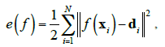{ loading=lazy }
  <figcaption>MSE最小平方误差（图 1）</figcaption>
</figure>

优化目标：

<figure markdown="span">
  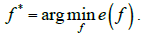{ loading=lazy }
  <figcaption>MSE最小平方误差（图 2）</figcaption>
</figure>

#### 4.1.2 最小化熵

信息熵反应信息的不确定程度，也是其中的信息量。

<figure markdown="span">
  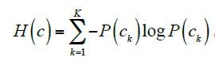{ loading=lazy }
  <figcaption>最小化熵（图 3）</figcaption>
</figure>

详见： [https://www.jianshu.com/p/8a0ad237b0ed](https://www.jianshu.com/p/8a0ad237b0ed)

还有交叉熵、互信息等。

<figure markdown="span">
  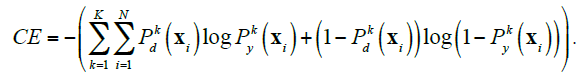{ loading=lazy }
  <figcaption>最小化熵（图 4）</figcaption>
</figure>

总结：

（1）信息熵是信息量的期望值；

（2）相对熵KL散度是如果用另外一个Q分布来描述原本用P描述的问题，得到的信息增量（产生的熵）

（3）交叉熵是KL散度加上原始P的信息熵；

与MSE相比，交叉熵是概率之间的度量；MSE是真值之间的差距。交叉熵收敛更快。

#### 4.1.3 MLE极大似然估计

和最小化熵类似，通过概率的乘积作为学习目标。

<figure markdown="span">
  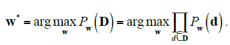{ loading=lazy }
  <figcaption>MLE极大似然估计（图 5）</figcaption>
</figure>

something interesting：

<figure markdown="span">
  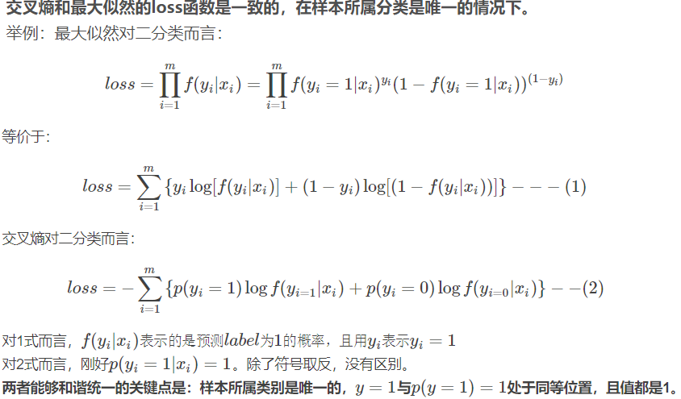{ loading=lazy }
  <figcaption>MLE极大似然估计（图 6）</figcaption>
</figure>

#### 4.1.4 MDL最小描述长度

奥坎姆剃刀原则的一种体现。

将函数对训练数据的拟合程度与函数的复杂度统一用描述长度进行表达，将其最小化。

### 4.2 记忆学习

顾名思义，理解成打表好了。

### 4.3 决策树与随机森林RF

#### 4.3.1 决策树

用以解决离散的输入输出映射。就不给实例了

#### （1）ID3算法——基于信息增益的决策树生成算法

根据训练数据，每层中选取分类能力最强的节点最为根节点，按照这个属性进行分支。迭代完成生成树。

熵的减小幅度称为信息增益。思想解释就是让树能够更快地减少信息的不确定性（信息熵）。

该算法存在过学习问题。生成的决策树可能太复杂了。

另有C4.5算法，用信息熵增益比率划分

#### （2）基于最小描述长度的决策树学习算法

藉由控制一下树的复杂程度。

#### 4.3.2 随机森林

一座森林那么多的决策树，每棵树随机抽取一部分数据进行学习生成

最终综合考虑所有决策树的分类结果

### 4.4 SVM

学习对象：线性判别函数

<figure markdown="span">
  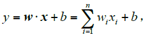{ loading=lazy }
  <figcaption>SVM（图 7）</figcaption>
</figure>

学习目标：

<figure markdown="span">
  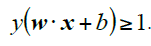{ loading=lazy }
  <figcaption>SVM（图 8）</figcaption>
</figure>

详见： [https://blog.csdn.net/b285795298/article/details/81977271](https://blog.csdn.net/b285795298/article/details/81977271)

部分推导：

对其进行归一化

<figure markdown="span">
  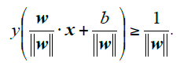{ loading=lazy }
  <figcaption>SVM（图 9）</figcaption>
</figure>

因此学习目标可以表现为

<figure markdown="span">
  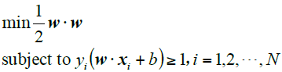{ loading=lazy }
  <figcaption>SVM（图 10）</figcaption>
</figure>

拉格朗日约束优化KKT条件解决

<figure markdown="span">
  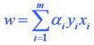{ loading=lazy }
  <figcaption>SVM（图 11）</figcaption>
</figure>

<figure markdown="span">
  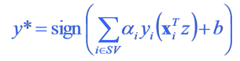{ loading=lazy }
  <figcaption>SVM（图 12）</figcaption>
</figure>

*αi *是拉格朗日系数，要受到KKT条件约束；

通过 *y\* *来判断新数据 *z *的标签

<figure markdown="span">
  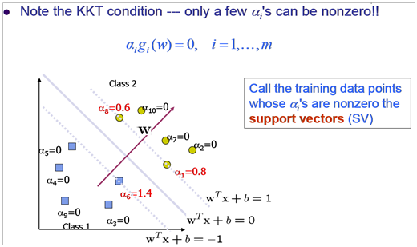{ loading=lazy }
  <figcaption>SVM（图 13）</figcaption>
</figure>

优化方法：SMO序列最小化算法

// TODO

（貌似是通过带入大量数据，求得最好的非0的 *αi *们？然后可以表达最好的w）

#### 核函数方法

把w的转化形式带回原拉格朗日方程，可得到方程如下

<figure markdown="span">
  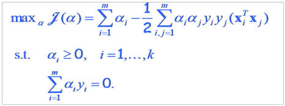{ loading=lazy }
  <figcaption>核函数方法（图 14）</figcaption>
</figure>

<figure markdown="span">
  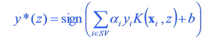{ loading=lazy }
  <figcaption>核函数方法（图 15）</figcaption>
</figure>

#### 松弛变量方法

<figure markdown="span">
  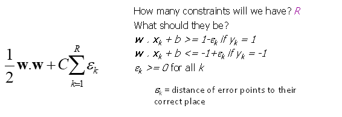{ loading=lazy }
  <figcaption>松弛变量方法（图 16）</figcaption>
</figure>

#### 4.4.1 拉格朗日乘子法与KKT约束

KKT详见： [https://www.cnblogs.com/liaohuiqiang/p/7805954.html](https://www.cnblogs.com/liaohuiqiang/p/7805954.html)

带约束的优化问题的一般形式：

<figure markdown="span">
  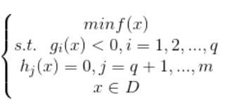{ loading=lazy }
  <figcaption>拉格朗日乘子法与KKT约束（图 17）</figcaption>
</figure>

*若f(x)，h(x)，g(x)三个函数都是线性函数，则该优化问题称为线性规划。若任意一个是非线性函数，则称为非线性规划。*

*若目标函数为二次函数，约束全为线性函数，称为二次规划。*

*若f(x)为凸函数，g(x)为凸函数，h(x)为线性函数，则该问题称为凸优化。*

*注意这里不等式约束g(x)<=0则要求g(x)为凸函数，若g(x)>=0则要求g(x)为凹函数。*

##### （1）等式约束

f(x)在h(x)约束下的情况。

<figure markdown="span">
  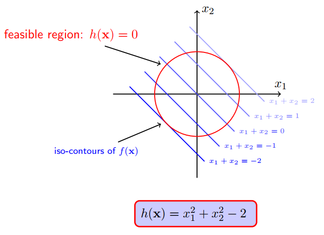{ loading=lazy }
  <figcaption>拉格朗日乘子法与KKT约束（图 18）</figcaption>
</figure>

<figure markdown="span">
  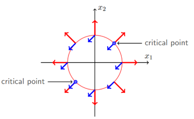{ loading=lazy }
  <figcaption>拉格朗日乘子法与KKT约束（图 19）</figcaption>
</figure>

可知最优化情况是函数与约束的梯度相等或反向。

此时有拉格朗日乘子法

<figure markdown="span">
  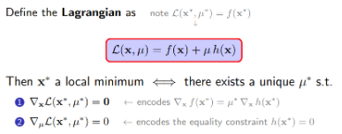{ loading=lazy }
  <figcaption>拉格朗日乘子法与KKT约束（图 20）</figcaption>
</figure>

##### （2）不等式约束

极小点在可行域之内的时候，相当于没有约束；

极小点在可行域之外的时候：

<figure markdown="span">
  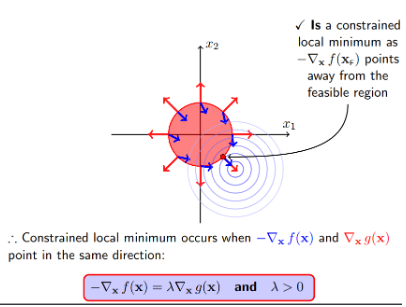{ loading=lazy }
  <figcaption>拉格朗日乘子法与KKT约束（图 21）</figcaption>
</figure>

极小点落在g(x)边界上，则g(x)=0，且f(x)与g(x)梯度方向相反

最终（1）（2）整理得到以下KKT条件

<figure markdown="span">
  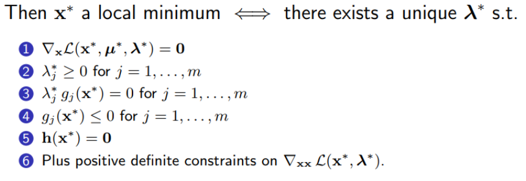{ loading=lazy }
  <figcaption>拉格朗日乘子法与KKT约束（图 22）</figcaption>
</figure>

1-拉格朗日乘子法，要求f与h、g梯度共线；2-f、g梯度相反；3/4-x在g(x)内或边界上；5-x在h(x)上（即上文等式限定中的第二条）；\*6-正定用来保证是最小点

以下公式是KKT限定的满足方法，通过**α=argmaxL**来达到判断KKT限定满足条件的效果，如果不满足，那就搞成无限大，我们这一组w向量机就不要了（hard SVM）；如果满足，就正经好好地计算距离和来判断向量优劣。

（解释一下，就是，当条件不满足的时候，α可以为整数，而不是大公无私地为0导致没能判断出来条件不满足。且让α为0只存在于在g内，就是说不用管这个g了，不计算了。这个max导致的结果就是，要么g为0 α无所谓，要么在g内 α为0，要么在g外 α无限大）

<figure markdown="span">
  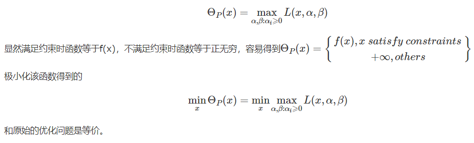{ loading=lazy }
  <figcaption>拉格朗日乘子法与KKT约束（图 23）</figcaption>
</figure>

#### 4.4.2 拉格朗日对偶性

在约束优化问题常常把原始问题转化成对偶问题来求解。因为无论原始问题是否是凸的，对偶问题都是凸优化问题。

//TODO

详情： [http://www.cnblogs.com/liaohuiqiang/p/7818448.html](http://www.cnblogs.com/liaohuiqiang/p/7818448.html)

### 4.5 贝叶斯学习

极大后验估计。

<figure markdown="span">
  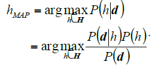{ loading=lazy }
  <figcaption>贝叶斯学习（图 24）</figcaption>
</figure>

#### 4.5.1 朴素贝叶斯分类 NBC

假设数据所有分量相互独立。

分类决策公式：

<figure markdown="span">
  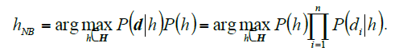{ loading=lazy }
  <figcaption>朴素贝叶斯分类 NBC（图 25）</figcaption>
</figure>

利用频率估计或分布进行学习

#### 4.5.2 贝叶斯信念网BBN

数据因素之间存在关联，形成网络。

如果所有数据关联可观察，直接MLE频率估计等

如果不可，梯度上升进行学习

#### 4.5.3 高斯混合模型GMM

<figure markdown="span">
  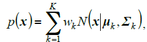{ loading=lazy }
  <figcaption>高斯混合模型GMM（图 26）</figcaption>
</figure>

学习方法有两种：EM或MME最大最小后验伪概率

##### （1）EM

生成学习算法

另有EM-MDL，通过最小描述长度自动确定分类组数

##### （2）MME

判别学习算法

核心思想是通过使正样本后验伪概率趋近1，负样本后验伪概率趋近0

后验伪概率是关于x对应输出值w的条件概率P(x|w)的一个单调递增函数，在\[0,1\]之间。

<figure markdown="span">
  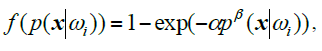{ loading=lazy }
  <figcaption>高斯混合模型GMM（图 27）</figcaption>
</figure>

*其出现的原理如下：*

<figure markdown="span">
  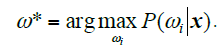{ loading=lazy }
  <figcaption>高斯混合模型GMM（图 28）</figcaption>
</figure>

*由贝叶斯：*

<figure markdown="span">
  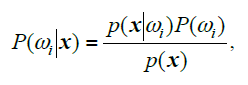{ loading=lazy }
  <figcaption>高斯混合模型GMM（图 29）</figcaption>
</figure>

<figure markdown="span">
  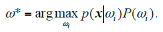{ loading=lazy }
  <figcaption>高斯混合模型GMM（图 30）</figcaption>
</figure>

*假设所有输出先验概率相等，则可简化掉P(Wi)*

由上定义所述，正样本后验伪概率趋近1，负样本后验伪概率趋近0，有

<figure markdown="span">
  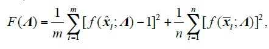{ loading=lazy }
  <figcaption>高斯混合模型GMM（图 31）</figcaption>
</figure>

用梯度下降法进行优化。

### 4.6 Boosting算法

#### 1 Boosting

改变样本权重，学习多个简单分类器线性组合；

#### 2 AdaBoost

一种组合分类器/回归的分类/回归算法。

组合多种算法，对每一种算法以及所有的数据分别赋权，错误率低的算法权值高，错误率高的数据权值高；总被做错的数据权值高，做对的数据权值低。迭代完成权值的学习。

<figure markdown="span">
  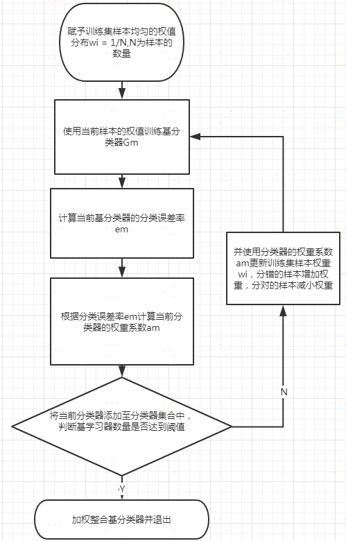{ loading=lazy }
  <figcaption>AdaBoost（图 32）</figcaption>
</figure>

#### 3 GBDT

采用CART（决策分类树，一种利用基尼系数确定每层决策结果的二叉树；回归时值得确定大概是选取对应类别的均值，用平方损失算）作为基分类器

一棵一棵树地拟合，前一棵树的误差会被作为后一棵树的学习目标进行训练。参数训练方法为梯度下降（使用平方损失时就是带符号的残差\*学习率），但学习率不能过快，不然会震荡不收敛

优点：在分布稠密数据上效果很好，可解释性好

缺点：高维稀疏数据表现不如SVM

Gini系数计算各个类别数据占比平方和，越小越好，最小为0。不需要对数计算，算得快，且只生成二叉树；深度学习用交叉熵，因为熵的对数在值接近0时梯度大，便于链式求导梯度下降；而决策树用不到

#### 4 XGBoost

GBDT的强化版

损失：采用loss函数进行泰勒展开的，同时利用其一阶和二阶导数做优化，优化更稳。因为一阶导数用来描述优化方向，但需要手调学习率；二阶导可以知道陡峭情况，可以一定程度控制不同曲率下的学习率

分类器：可采用更多的基分类器，例如线性分类器

放过拟合：通过Shrinkage控制学习率（每次迭代会乘上权重eta，防止前期学习过快）和Column Subsampling（列抽样，每轮采样一部分特征训练）防止过拟合，加入正则项控制过拟合，内置交叉验证

缺失值处理：叫做“稀释感知”，给一个default值，怎么收益大就怎么给

并行化好12：并不是并行学习，（大致）而是把数据按照某些特征提前划分好成block，然后后面会直接用这个数据

特征重要性：特征分裂次数，特征出现的树的收益和，特征在树的覆盖范围（影响的样本量）

能够学习出缺失值的处理策略

细节参考：https://www.nowcoder.com/discuss/569667266061541376

#### 5 LightGBM

精度好，速度快

在分割策略上，不像XGBoost从所有特征中找最优，而是采用直方图法，把浮点特征离散成直方图（但现代 XGBoost也可以用直方图）

在分裂策略上，XGBoost每次分裂一层，LightGBM每次分裂最优的叶子

内置特征降维，并发实现更好，并发包括数据并发（多个机器同时处理不同直方图）和特征并发（每个机器观察一部分特征）

详见 [https://www.cnblogs.com/jiangxinyang/p/9337094.html](https://www.cnblogs.com/jiangxinyang/p/9337094.html)
