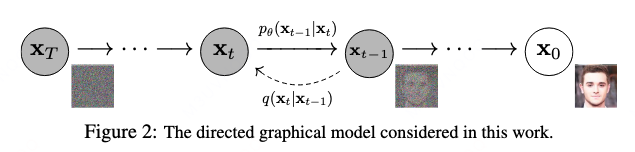
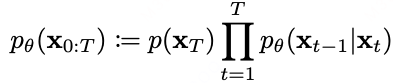
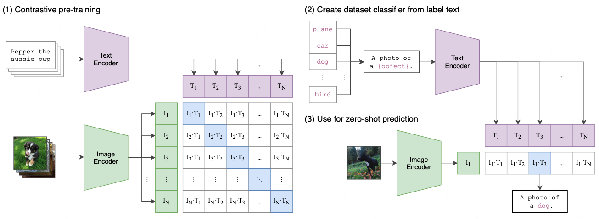
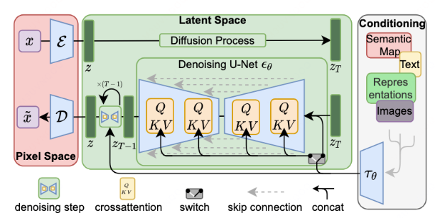

# [简介]现代 AI 图像生成技术

*创建时间：2026-02-02*

*更新时间：2026-09-12*

## 扩散模型 DDPM

**基石论文：** *Denoising Diffusion Probabilistic Models*

经典的生成式模型，例如 GAN，是在用模型拟合一个高维空间的概率密度函数，让其能尽量满足真实数据的分布（概率密度）。训练完成后，给出随机参数，即可产生类似真实数据的结果。

但概率密度难以训练，主要是因为超高维特征空间中的数据非常稀疏。GAN 采用对抗方式训练，但对抗训练很不稳定。

DDPM 提出使用马尔科夫链来模拟模型学习的过程，替代掉对概率密度函数的学习。

<figure markdown="span">
  { loading=lazy }
  <figcaption>DDPM 前向加噪与反向去噪过程</figcaption>
</figure>

作者通过公式推导证明，概率密度函数可以通过马尔科夫链转化成多个单步的预估：

<figure markdown="span">
  { loading=lazy }
  <figcaption>DDPM 概率关系</figcaption>
</figure>

> 从 $T$ 到原图 $x_0$ 的概率密度函数，可以经由给定随机参数 $x_T$，然后按照每一步的条件概率函数连乘得到。

如此一来，对完整概率密度函数的模拟，变成了对马尔科夫链上单步条件概率密度函数的模拟，一定程度上简化了学习的复杂性。

更进一步，作者设定从图像到噪声的过程是加入随机高斯噪声。如此，把对条件概率密度函数的学习转化成了对高斯噪声的预估这种有监督问题：通过尽量准确地预估出每一步的噪声来训练网络，并对输入进行一次去噪，从而实现对条件概率密度函数的模拟。

具体模型设计上使用基本的 U-Net；模型的优化目标是让模型能够准确预测两步之间的噪声值，即最小化真实噪声值与预估噪声值的均方误差。

> **个人理解：** 复杂任务简单化，监督学习总是比生成学习更稳定一些。

## 多模态对齐 CLIP

**基石论文：** *Learning Transferable Visual Models From Natural Language Supervision*（ICML 2021）

早期模态对齐任务倾向于预测一张图片的标题，通过这种方式让模型提炼图像的语义特征。但数据量少，训练难度较大。作者转而通过对比学习，让相似的图像与相似的文本在映射后的特征空间中尽量接近，使用特征向量的余弦相似度进行衡量。

<figure markdown="span">
  { loading=lazy }
  <figcaption>CLIP 对比学习结构</figcaption>
</figure>

具体实现上，一个图像模型（ResNet、ViT）配合一个文本模型（Transformer），直接进行对比学习：相同 Pair 的距离更近，不同 Pair 的距离更远。

> **个人理解：** 对比学习比监督学习的判别任务更简单易学，对 Embedding 学习作用大。

## 潜在扩散模型 LDM

**论文：** *High-Resolution Image Synthesis with Latent Diffusion Models*（CVPR 2022）

*Stable Diffusion 是一个基于 Latent Diffusion 的训练实现。*

DDPM 是像素维度的模型，每一步都是还原成图像，很慢；实际上，图像的信息密度很低，很多语义只需要很低的维度即可。

<figure markdown="span">
  { loading=lazy }
  <figcaption>Latent Diffusion Model 结构</figcaption>
</figure>

所以本文提出了 Latent Model，通过一对 AE 把图像降维到 Latent Space。AE 的优化目标就是复原图像，不过加入了一个 KL 散度正则，使其趋近正态分布。

然后对 AE 提取出来的隐空间特征进行 DDPM 的流程。

此外，为了能够对外部文本或其他模态输入响应，使用了外部的 CLIP 对齐预训练模型来 Embedding 文本或其他类型的输入，并通过 Cross-Attention 结合到 U-Net 中。这个位置既没有显式要求扩散模型与 CLIP 的文本模型对齐，也没有要求扩散模型一定要按照文本内容输出图像。模型的训练内容依然是复原图像、去掉噪声；而 CLIP 过来的其他特征作为输入条件（像是 Uplift 中 S-Learner 的输入 $T$），当面对大量“类似图像具有类似文本特征”的情况时，模型便会开始利用这部分特征辅助预测噪声、生成图像。

> **个人理解：** 1. 去芜存菁，用于加速或防止过拟合；2. Attention，就用吧；3. 多模态特征的“利用”关系很有趣，但想不到有什么用。
