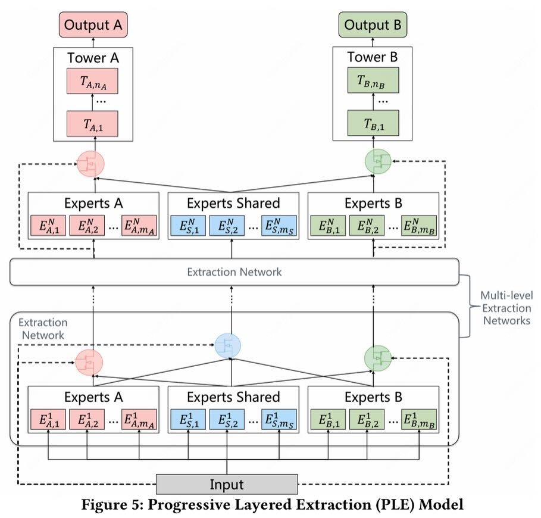
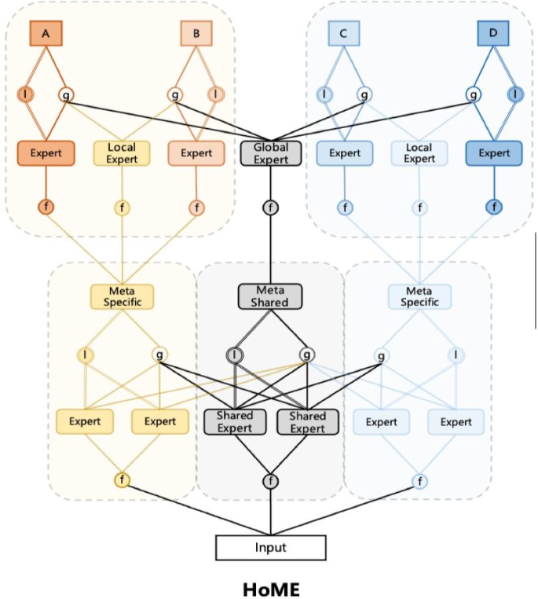

# [简介]多目标学习

*创建时间：2024-08-21*

*更新时间：2026-05-03*

## 模型结构

### ESMM

想估 CVR，但数据量少且受 CT 影响；通过同时学习 CTR 和 CTCVR 来倒算 CVR，提高准确性。

### MMoE

一堆共享专家，加子任务塔；每个子任务塔有自己的门控，门控通过所有专家的 input 给所有专家的输出进行 Softmax 调权。

### AITM

任务之间具有顺序关系，任务塔的结果通过前序输出对后续进行 Attention，并加入单调性校准 Loss。

### PLE

对 MMoE 的跷跷板问题进行优化。MMoE 网络的专家网络是全局共享的，冲突导致专家层目标割裂。

1. **显式专家分离**：专家分为共享与任务独有。
2. **Progressive Layered Extraction**：高层级专家可以取得上一层“有相关的”专家输出。
3. **Selective Routing**：专家输出使用门控。如果是第一层，利用“所有输入”特征过一层 Linear 变权重，对“有相关的”专家输出进行 Softmax 调权；如果不是第一层，则仅利用“自己专家”的输出作为调权输入。

<figure markdown="span">
  { loading=lazy }
  <figcaption>PLE 模型结构</figcaption>
</figure>

### MFH

MFH（Multi-Faceted Hierarchy）：解决大量目标任务、不同任务共享关系不同的结构问题，通过层级来处理共享专家的归属，算个 trick 论文吧。

### HoME

快手 25 年 KDD，面对 Expert Collapse、Shared 专家被独占、稀疏专家无法有效学习三个问题，提出模型改造方案：

- **Expert Norm 与 Swish 激活**：通过 BN 对每个专家的数据进行尺度标准化到 $\mathcal{N}(0,1)$，并使用 SiLU 激活，避免量纲差距过大。
- **分层共享设计**：类似 MFH，分为全共享、领域共享、私有三层，即比 PLE 多一层领域共享，避免共享专家被无关任务完全忽略。
- **特征选择门**：对每个专家通过低秩矩阵分解计算每个特征在 0～2 范围内的权重控制。

<figure markdown="span">
  { loading=lazy }
  <figcaption>HoME 模型结构</figcaption>
</figure>

### AutoMTL

KDD 24，基于数据自动学习模型结构，能够通过可离散的门控选择哪些任务共享专家。

## 多目标梯度优化

用来解决多个目标梯度方向互相冲突或权重难以评估的场景。

- **GradNorm**：大致思路是通过增加一个控制 $w$ 的 Loss，瞄着一个平均值，让学得快的慢一些，学得慢的快一些。
- **PCGrad**：梯度裁剪。当任务梯度冲突时，将一个任务的梯度投影到另一任务梯度的法平面，移除冲突分量。
- **CAGrad**：保护最小梯度，通过让新梯度与最小梯度尽量相同，且尽量与原始梯度相同。需要 Trade-off 超参数。
- **Nash-MTL**：推导了一个 Nash 公式 $GG^\mathsf{T}w=1/w$，算出每个目标的权重 $w$。在该状态下，$\sum\log(\Delta L_i)$ 最大，$\Delta L_i$ 意味某目标的损失已经优化了多少。意义上，Sum Log 等于累乘。
- **MGDA**：找一个所有目标方向上都能或多或少接受的最小梯度，来逐步逼近帕累托前沿。

## 多目标问题诊断

- 通过梯度的余弦相似度判断目标方向是否一致。
- 通过梯度大小判断是否存在 Dominance。
- 通过 Gate 分布观察专家是否 Collapse。
    - 在多目标模型中，考虑调整 Loss（最大化信息熵、样本均衡）、改善训练性、限制共享，后两个就是 HoME。
    - LLM 中使用 Balance Loss 和 Bias 负载均衡。
