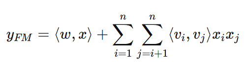
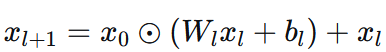
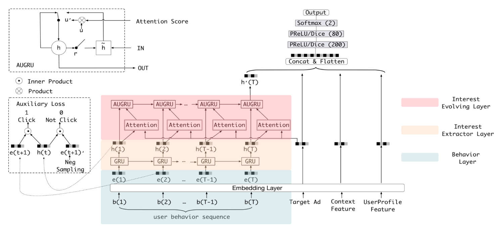
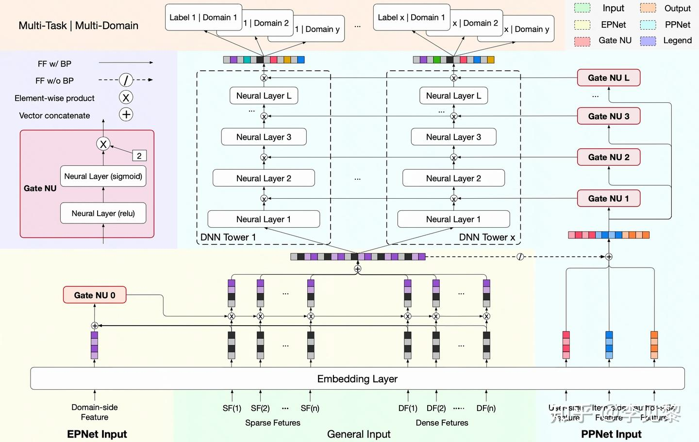
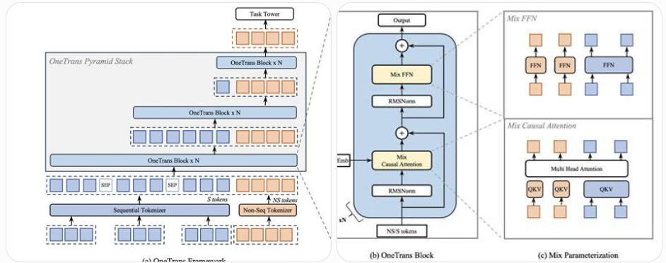

# [简介]推荐系统模型速览

*创建时间：2026-07-27*

*更新时间：2026-09-12*

## 经典推荐模型

### DeepFM

把 Wide & Deep 的 Wide 部分通过 Inner Product 替换掉，计算一阶值与二阶特征交叉内积（标量）。

<figure markdown="span">
  { loading=lazy }
  <figcaption>DeepFM 模型结构</figcaption>
</figure>

### DCN v2

Cross 部分通过 $d \times d$ 的矩阵 $W$ 把 $x_l$ 内部组合，然后与 $x_0$ 逐元素乘，达到完全组合的目的；Deep 部分还是 Deep。$W$ 可以通过 $V \times U$ 低秩到 $r$ 维处理，$1 < r \ll d$。

<figure markdown="span">
  { loading=lazy }
  <figcaption>DCN v2 Cross Network 结构</figcaption>
</figure>

### DIN

用户近期行为与 Ad 进行 Activation 计算并给行为加权；Activation 是行为与 Ad 点对点乘或加减，然后 Concat 行为、Ad、权重，再过 Linear；激活函数 Dice 先 BN 再 Sigmoid 来避免饱和与分布震荡（像 HoME），然后给 $x$ 和 $wx$ 加权输出（两个值，避免激活后进入不活跃区）；最后把汇总的加权行为、Ad、Context Concat，一起放入 Dice 激活的 MLP（参考 DIEN 的图）。

### DIEN

用户近期行为通过 GRU 处理，再与 Ad 进行 Attention（不再是原来的 Activation）计算，给行为通过独立的 AUGRU 模块来加权；同时为了辅助 GRU 学习，设计了一个让 GRU 输出近似于下一时刻序列的正行为 Embedding、远离负行为 Embedding 的辅助损失；其他部分都一样。

<figure markdown="span">
  { loading=lazy }
  <figcaption>DIN 与 DIEN 模型结构</figcaption>
</figure>

### PEPNet

EPNet 通过 Domain（如场景 ID、用户 × 场景、物品 × 场景特征）+ Embedding 对 Embedding 调权；PPNet 通过定制输入（如 User Feature、Item Feature 等）+ EP 处理过的 Embedding 对模型 Layer 输出调权。这些调权特征通过两个 MLP 组成的 GateNU 模块缩放到 0～2 之间（每个层级一个独立门）。EPNet、PPNet 门控部分的梯度不回传给 General Input。

<figure markdown="span">
  { loading=lazy }
  <figcaption>PEPNet 模型结构</figcaption>
</figure>

## Scaling Law 时代

- **Wukong**：堆叠一个独特的 FM 模块，逐层建模更高阶的特征交叉。
- **RankMixer**：把 User、Item、Sequence 等 Embedding 分别映射成 Token，然后把不同类型 Token 的维度分散组合到每个 Token 中，提高 GPU 利用率。它的 FFN 和 OneTrans 一样，一个 Token 使用一组 FFN。
- **LONGER**：解决超长序列依赖的结构设计。
- **HSTU**：设计更适合推荐系统的 Transformer。
- **OneTrans**：通过一站式 Transformer 预估 CTR。
- **OneRec**：直接端到端生成推荐结果。

### HSTU

- **核心理念**：解决推荐系统中序列、特征交叉、多目标等无法被统一模块 Scaling Up 的问题，把各种特征统一成序列输入，并将 Transformer Decoder 按照推荐系统的业务理念进行改造。主要解决序列特征的 Scaling。
- **投影层**：由 QKV 改为 QKVU 四项。
- **Attention 模块**：
    - $Z = \operatorname{SiLU}(QK+r)V$
    - 由 Softmax 的 QK 打分改成 SiLU 打分。Softmax 对相对强度强调更多，而 SiLU 能更好地体现绝对强度。
    - Attention 中加入 Position Bias 与 Time Bias，引入时间距离。
- **使用 U Gate 替代 FFN**：
    - $Y = f(\operatorname{Norm}(Z) \cdot U)$，之后再通过残差把 $X$ 加回来。
    - 可以理解为 Gated Feature Interaction。
- **模型输出**：一个 Item 对应一个 Action，例如“篮球—点击”“美食—收藏”。

### OneTrans

- **核心理念**：解决推荐系统中各种序列、非序列特征无法统一放入 Transformer 进行 Scaling Up 的问题。通过整体设计 OneTrans 结构块，让模型的 Length、Depth、Width 可以统一扩展。
- **统一 Token 化**：序列特征 Embedding 按序列映射处理成 Token；非序列特征 Embedding 让模型通过一个 MLP 统一 Auto-Split 到几个 Token 中，也可以人工划分，但效果更差。
- **序列特征金字塔**：序列特征 Token 每层都会把最早的一部分特征删去，仅保留后面的特征，降低复杂度。因为 Causal Attention 模块让后序特征总是会学习并提取前序特征。删除后依然保留 KV 部分，供后续特征进行 Attention。
- **Mix-Causal Attention**：序列特征 S 使用正常的 $W_q/W_k/W_v$ 映射，但非序列特征 NS 的每个 Token 有一组自己的映射函数 $W_i$。因为非序列特征语义空间不同，所以独立学习。映射完成后，把所有特征 Stack 到 Sequence 维，再正常执行多头 $QK^\mathsf{T}V$；FFN 部分也采用相同的 Mix 划分。
    - 激活函数使用 Softmax，但可以考虑换成 HSTU 的 SiLU 来强化推荐强度。
    - 使用 Causal Attention，有助于使用 KV Cache 进行工程优化；Bidirectional Attention 没有消融优势。

<figure markdown="span">
  { loading=lazy }
  <figcaption>OneTrans 模型结构</figcaption>
</figure>
