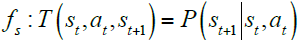
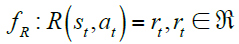
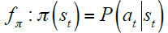
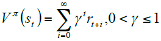
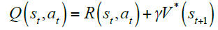
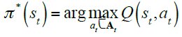
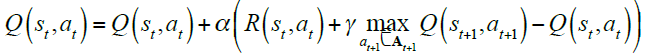
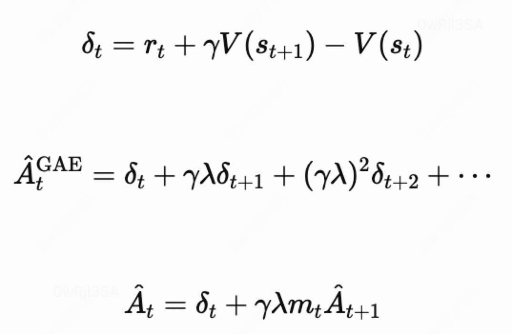
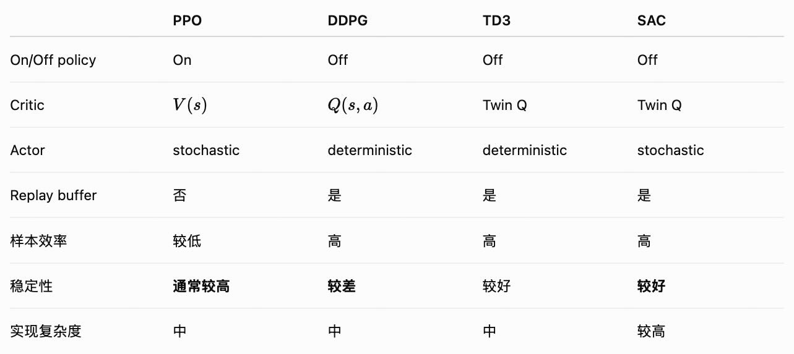

# Reinforcement Learning

*创建时间：2019-01-06*

*更新时间：2026-03-01*

在强化学习语境下，机器的行为和学习是交替进行的。

观察状态state、根据当前行动策略policy，执行行动action，查看收益reward。

## 1 马尔科夫决策过程

如果行动后获得的即时收益r与环境变化δ仅取决于当前状态，成为马尔科夫性。

状态转移模型

<figure markdown="span">
  { loading=lazy }
  <figcaption>状态转移模型</figcaption>
</figure>

收益函数

<figure markdown="span">
  { loading=lazy }
  <figcaption>收益函数</figcaption>
</figure>

策略函数

<figure markdown="span">
  { loading=lazy }
  <figcaption>策略函数</figcaption>
</figure>

学习目标：策略评估函数

<figure markdown="span">
  { loading=lazy }
  <figcaption>状态价值函数</figcaption>
</figure>

γ是折扣系数

由于V数值很多场合难以计算，计算Q数值代替

<figure markdown="span">
  { loading=lazy }
  <figcaption>动作价值函数</figcaption>
</figure>

Q数值和当前状态与动作相关，表示S状态下采取行动a后，在接下来均采取最优策略所获得的累计收益。新优化目标如下：

<figure markdown="span">
  { loading=lazy }
  <figcaption>最优策略</figcaption>
</figure>

### 1.1 V值策略迭代算法

根据初始状态与策略更新V值，然后更新策略，迭代更新V值。

### 1.2 Q学习算法

核心思想是，观察当前环境，更新前一状态的Q值，根据当前的Q值决策。

<figure markdown="span">
  { loading=lazy }
  <figcaption>Q-learning 更新公式</figcaption>
</figure>

与V值算法相比，这是模型无关的，无需记忆并更新环境模型。但效率太低。

### 1.3 Off-policy 评估方法

可以用在所有的反事实评估中。

| 方法 | 核心思路 |
| --- | --- |
| Direct Method Estimator（DM） | 直接使用统计数据来加权评估 |
| Inverse Propensity Scoring（IPS） | IS 思想：$Y_i \cdot \pi(A_i\mid X_i) / P_i$ |
| Doubly Robust（DR） | 预估结果 $+\ \pi(A_i\mid X_i) / P_i \cdot (Y_i - \text{预估结果})$ |

其中π是目标分布，如果是全空间内那就是1。如此预估概率与预估结果有一个准就可以

??? note "IS 期望无偏推导"

    希望求的期望：

    $$
    \mathbb{E}_{\pi}[r]
    = \sum_a \pi(a\mid x)r(s,a)
    = \sum_a \frac{\pi(a\mid x)}{P_i}P_i r(s,a)
    $$

    根据期望定义，可换得：

    $$
    \mathbb{E}_{P_i}\left[\frac{\pi(A\mid X)}{P_i}r\right]
    $$

### 1.4 On-policy 与 Off-policy

=== "On-policy"

    数据是策略自己产生的，更新策略后完全不能用旧数据，各种 policy-based 算法。

=== "Off-policy"

    数据是探索策略产生的，两者可以有一定代差，逐渐逼近一个固定的目标，Q-value 算法。

### 1.5 Q-based

- 核心学习内容：$Q(s_t,a) \rightarrow Q(s_{t+1},a_{t+1}^{\mathrm{best}})+r$
- dqn，d3qn：直接估计Q，选择最好的a
- ddpg：连续行为无法枚举最好，使用一个Actor出“最佳”行为，一个Critic估计Q，然后使用两对网络避免移动靶问题。两组模型，学Q的时候用第二组Target模型出“下一步的”Q'，结合真实单步reward教第一组（就是Critic的单步TD），学A的时候用自己的Q
- Td3：给ddpg每个critical加一组q，然后取小者，降低自举
- sac：与td3基本一样，就是学习目标加了个熵，增强行为探索能力
- Qbased的模型通常需要2组模型，避免自举（每次学习目标都是argmax导致）

### 1.6 Policy Gradient

- 优势估计 $A(a,s)=Q(a,s)-V(s)$，$Q$ 代表 $s$ 下 $a$ 状态后全局得分，$V$ 代表 $s$ 下全局得分
    - MC方法：偏差小方差大，训练不稳定，成本高
    - 单步TD：$A=r+V(s+1)-V(s)$，方差小偏差大，依赖 $V$ 准
        - 其原理来源于bellman bootstrap，如果目标收敛，可以满足用下一步的预估值当做未来收益的一部分
- 核心学习内容：$V(s)\rightarrow Q(s,\pi(s))=A+V(s)=\mathrm{TD}:r+V(s+1)=\mathrm{GAE}+V(s)$
- ac，a3c：一个当做π，一个估计v，v用单步TD来学习。A3c用来多线程

#### PPO

!!! abstract "核心记忆点"

    Actor 网络是一套策略分布生成器，Critic 是评估 Actor 在某状态下的打分，本状态打分通过下一状态 Base 值与真实行为 Reward 来逼近学习。

**Policy gradient**

$$
L_{\mathrm{PG}}=-\mathbb{E}\left[\log\pi(a\mid s)\left(Q(a\mid s)-V(s)\right)\right]
$$

后文用 $A$ 指代优势收益 $Q(a\mid s)-V(s)$。这里 $V$ 使用采样时 Critic 的旧预测快照，避免学习目标一直变动。

一阶 TD-advantage 的思路为：

$$
Q(a\mid s)\approx V(s+1)+\mathrm{reward}
$$

GAE 会更加精细，在采集数据阶段计算“链路完整”的 Reward。

**Importance Sampling**

$$
r_t=\exp\left(\log\pi(a_t\mid s_t)-\log\pi_{\mathrm{old}}(a_t\mid s_t)\right)
$$

它等价于两个概率之比，但这种实现能够避免概率数值过小导致下溢。这个是通过数学推导，求新行为在旧行为分布上的期望值转化的。

**PPO 标准损失**

$$
L_{\mathrm{PPO}}=-\mathbb{E}[r_tA_t]
$$

**裁剪后的损失**

$$
L_{\mathrm{clip}}=-\mathbb{E}\left[\min\left(r_tA_t,\operatorname{clip}(r_t,0.8,1.2)A_t\right)\right]
$$

其中 $\min$ 的作用其实与 if 等价。

**Critic 的学习目标**

$$
V(s_t)\rightarrow A_t+V_{\mathrm{old}}(s_t)
$$

**GAE** 相当于“多步 TD”，综合考虑方差与偏差，使用加权递推估计。$\lambda=0$ 时相当于一阶 TD，$\lambda=1$ 时近似蒙特卡洛减去 baseline，一般使用 0.95 左右。$\gamma$ 用来控制长期信息的影响力度。

<figure markdown="span">
  { loading=lazy }
  <figcaption>GAE 计算公式</figcaption>
</figure>

??? tip "其他工程细节"

    - PPO会给Actor加一个策略熵 $H(\pi(\cdot\mid s))$ 避免收敛过快
    - 会对Advantage使用均值与方差归一化来稳定梯度尺度，防止梯度异常把模型搞坏
    - 超参数可以直接套用StableBaseline(如SB3)
- 一般来说，PPO比DDPG更稳定，因为Actor自举与bootstrapping——没有多层TD来规范化结果、并且off-policy，每次学习的都是 $Q(s)=r+Q(s+1)$，误差传递，并且actor学让Q最大对行为，越学误差，误差越大actor越学。不过TD3和SAC其实也在做优化。
    - 也称死亡三角，bootstrap的单步TD，加上offpolicy（，以及广泛存在的函数拟合），导致策略外推，训练错误

<figure markdown="span">
  { loading=lazy }
  <figcaption>PPO、DDPG、TD3 与 SAC 对比</figcaption>
</figure>

- 在一些action训练不稳定情况下，critical网络要比action更新慢一些，避免action跟不上
    - Ddpg通常两者同步更新

### 1.7 Offline-rl

- 模仿学习：直接学习专家行为
- Bandit：
    - Multi-arm bandit，无状态，仅讨论行为与收益，如thompson采样等方法
    - Contextual bandit：单步RL
- 核心难点在于ood，给没见过的行为过高分
    - 有一些经典方法，通过降低没见过行为的选择或得分来控制

## 2 LLM 强化学习与 RLHF

### 2.1 经典流程

SFT → Reward Model → PPO

- SFT用固定的语料训练
- 通过人工标注的回答偏好对训练Reward Model

### 2.2 PPO

-   **Actor / Policy**

    需要训练的策略模型

-   **Critic / Value**

    估计状态价值，训练目标依然是 $A+V_{\mathrm{old}}(s)$

-   **Reward Model**

    给出完整行为序列最终的 reward

-   **Reference Model**

    SFT 后冻结的 LLM，用于计算 KL 约束

### 2.3 DPO

- 流程改为 SFT → DPO
- 使用已经收集的 prompt、preferred response 与 rejected response；结合冻结的 reference model，让模型相对于 reference 提高 preferred response 对 rejected response 的概率优势
- 不再显式训练 Reward Model，也不需要 PPO rollout 和 Critic

### 2.4 GRPO

用一组回答的均值替代掉critic。

### 2.5 GSPO

在grpo基础上，不再是每个token更新一次，而是整条链路结束后统一更新。

### 2.6 为什么没有用 SAC 之类

因为要控制不能跑太远。

参考链接：https://zhuanlan.zhihu.com/c\_1215667894253830144
