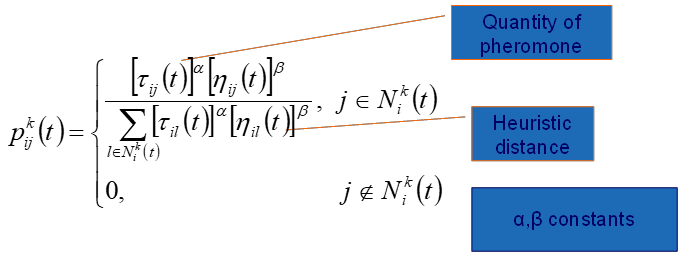
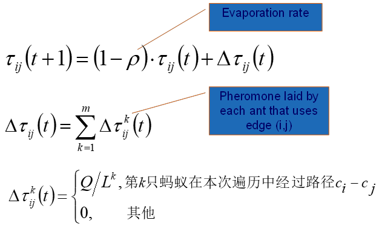
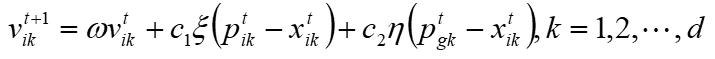
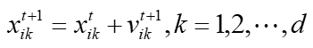

# Swarm Intelligence

*创建时间：2019-01-08*

## SI 的组成

- Agents：与世界或互相交流的实体
- Simple Behaviors
- Communication

## SI 特点

- 没有数据，没有控制
- 有限的交流
- 不对环境建模
- 感知环境
- 对环境变化有反应

## Communication

agents 间交流的协议与互相协作的协议，包括两种方式：

### 1 Indirect communication

Blackboard System：公共信息交流存储区。各智能体通过黑板交换数据与信息。

### 2 Direct communication

通过 ACL（agent communication language）直接发消息。

## Ant Colony Optimization ACO 蚁群优化算法

包括**概率选择规则**与**信息素更新规则**，增加好的方案的信息素 pheromones，降低不好的方案的信息素。

以 TSP 问题为例：

**Construct Ant Solution：**

<figure markdown="span">
  { loading=lazy }
  <figcaption>蚂蚁路径选择概率</figcaption>
</figure>

**Update Pheromones：**

<figure markdown="span">
  { loading=lazy }
  <figcaption>信息素更新规则</figcaption>
</figure>

### 蚁群算法的其他优化

1. EAS Elitist Strategy for Ant System：最好的路线有信息素加成
2. ASrank Rank based Ant System：蚂蚁的信息素释放量随着出来的时间越来越晚
3. MMAS MAX-MIN Ant system：每一轮最好的路线才会留下信息素；设定信息素的最大最小范围
4. ACS Ant Colony System：会对信息素进行**局部更新**

## Particle Swarm Optimization PSO 粒子群优化算法

- 起源于 Bird flocking
- 每个个体存储并且交流他们所知道的最佳的解决方案
- 每个个体考虑自己曾经得到最好的解，同时参考大家最好的解来确定自己的方向
- 每个个体有自己的位置 `x` 与当前速度（与方向）`v`
- PBest 作为个体得到的最优解
- GBset 作为整体得到的最优解

<figure markdown="span">
  { loading=lazy }
  <figcaption>速度向量更新</figcaption>
</figure>

<figure markdown="span">
  { loading=lazy }
  <figcaption>位置向量更新</figcaption>
</figure>

- `v` 是速度向量
- `xi` 是点的位置（解）
- `Pi` 是自己 `t` 时刻曾经走过的最好的位置（个体最优解）
- `Pg` 是全局得到过的 `t` 时刻最好位置（全局最优解）
- `K` 是维度

### 算法特点

直接处理速度而不是位置，概念简单，计算高效。

[参考资料](https://www.cnblogs.com/BreezeDust/p/3354769.html)
