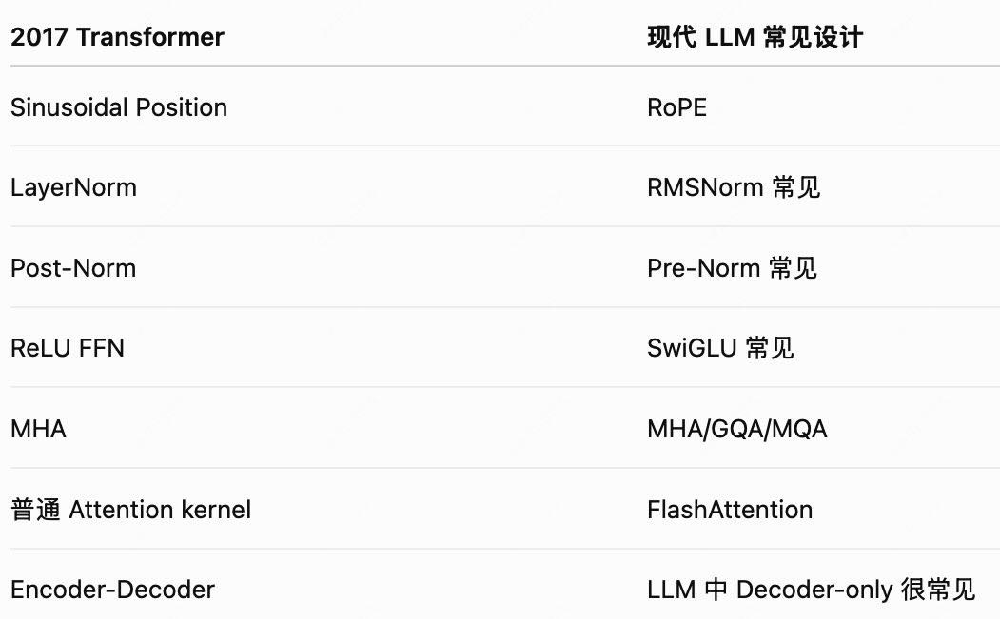
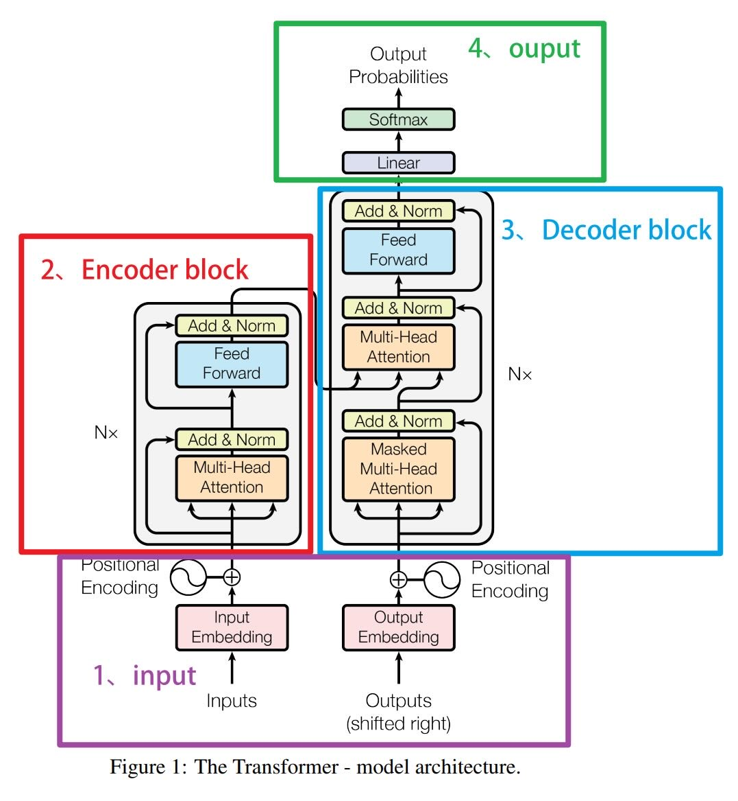

# Transformer

*创建时间：2025-08-25*

<figure markdown="span">
  { loading=lazy }
  <figcaption>Transformer 模块示意图</figcaption>
</figure>

## Decoder 训练目标

$$
\max \sum_t \log P(x_t\mid x_{<t})
$$

## Position Embedding

- Transformer 是无序的，如果不引入每个位置编码，无法知道 Sequence 上谁在前、谁在后。
- **原始结构 Position Encoding**：通过 Sin 与 Cos 确定一组坐标写入 Representation，能够在点积后直接根据三角函数表示相对距离——这个真神了……
- **现代结构 Rotary PE**：写入 Representation 会导致位置信息混入。Rotary 提出了直接旋转 Q 和 K，也能达到算入相对距离加权的方法。

## Block 结构

- **原始结构**：$X_1=\operatorname{Norm}(x+\operatorname{Attention}(x))$，$X_2=\operatorname{Norm}(X_1+\operatorname{FFN}(X_1))$。加入残差后再 Norm，残差会被层层 Norm 压缩。
- **现代结构**：$X_1=X+\operatorname{Attention}(\operatorname{Norm}(X))$，$X_2=X_1+\operatorname{FFN}(\operatorname{Norm}(X_1))$。Norm 后再加入残差，残差自始至终在外面，梯度更稳定。
    - 现代 LLM 的 Norm 通常使用 RMSNorm，去掉 LayerNorm 的减均值，仅拿均方根做 Re-scaling。
    - 思考：那为什么不 $X+\operatorname{Norm}(\operatorname{Attention}(x))$？因为输入给可训练层的值一定要被 Norm 过，否则深层会受浅层影响。

## Attention 模块

### 公式理解

1. Q - KV，K、V 通常来自同一输入；如果是 Cross Attention，K、V 来自 Encoder。
2. 具体公式：

    $$
    \operatorname{Attention}(Q,K,V)=\operatorname{softmax}\left(\frac{QK^\mathsf{T}}{\sqrt d}+\operatorname{Mask}\right)V
    $$

3. $Q(s\times d)K^\mathsf{T}(d\times s)$ 可以直接理解为：把 Q 中每个 Sequence 元素的一组 $d$ 个特征，依次与其他 K 中所有 Sequence 元素的 $d$ 个特征进行点对点余弦相似度计算，算出 Q 对每个 K 的打分 $(s\times s)$。
4. Softmax 作用在最后一个维度上，即对于每个 Q，计算它对所有 K 的打分并归一化，看每个 Q 应该关注谁。
5. $\sqrt d$ 是因为 Q 与 K 独立同分布、均值为 0、方差为 1，矩阵相乘会把方差扩大 $d$ 倍，所以除以 $\sqrt d$ 进行归一化，避免点积进入 Softmax 的饱和区。
6. Mask 一般直接给负无穷；Padding Mask 盖住对应位置；Causal Mask 盖住所有 $>i$ 的位置，从而可以让 Transformer 并行训练，相比 RNN，这种训练叫 Teacher Forcing：直接用一组数据对每个位置施加 Causal Mask 并行训练。

### 其他组件

1. **Attention Dropout**：通过 Mask 作用在 Attention 后的权重矩阵上，目的是避免依赖少数固定特征权重。
2. **KV Cache**：Inference 自回归生成内容时，为避免对前面的 K、V 反复重新计算，直接存储，使用时 Concatenate 在新的 K、V 之前。
3. **多头注意力**：一次 Attention Softmax 对一个 Sequence 词的全部特征组 $d$ 只能计算出一组注意力、找出一个最相似的；拆成多头后，可以把 $d$ 完全拆开，一个 Sequence 词可以根据不同的 $d$ 组合找到不同的关注位置。
4. **参数**：主要在于 $x$ 的投影，是一个 $d\times d$ 的矩阵：$X(s\times d)W(d\times d)\rightarrow s\times d$。多头也一样，不需要特殊处理，因为先拆再投影与先投影再拆是一样的。

## FFN 模块

- 就是两层 MLP，做 Feature 级别的处理；而 Attention 做 Sequence 级别的处理。
- **原始结构**：$W_2\operatorname{ReLU}(W_1x+b_1)+b_2$。$W_1$ 通常会把 $d$ 放大到 $d_{ff}$，$W_2$ 再缩回 $d$，一般 $d_{ff}=4d$。
- **现代结构**：SwiGLU = SiLU(a) · GLU(b)，通过 SwiGLU 替代 ReLU，避免负数梯度消失、神经元死亡。具体形式为：

    $$
    W_2\left[\operatorname{SiLU}(W_1x+b_1)\odot(W_3x+b_3)\right]
    $$

    其中，$\operatorname{SiLU}(x)=x\operatorname{sigmoid}(x)$，也叫 Swish-1，形如柔和的 ReLU，但在 0 左侧略为负数而不为 0，引入 0～1 门控且保留幅度与符号。$W_1$ 与 $W_3$ 放大维度相同，$W_2$ 收缩维度。
    - Hint：其实主要是 Swish 强于 ReLU 的功劳吧，避免负数梯度消失与神经元死亡问题，GLU 更像是为了引入复杂度而设计的。

## 工程优化

1. **FlashAttention**：面向数据 I/O 与显存使用的优化。FlashAttention 对 Q、K、V 分块计算，在片上 SRAM 中完成局部运算，减少 HBM 读写并避免显式存储完整注意力矩阵。
2. **GQA**：KV Cache 占据大量显存，于是从 K、V 的多头数量上找补，让少数头供给大量 Q 使用。MQA 让 K、V 只留一个头；GQA 让 K、V 保留 $x$ 个、但少于原本 Head 数量的头。这里的 Linear 层需要调整权重、改变 $D$ 的维度，不能再使用同一个层。
3. **MoE**：替换掉 FFN 模块，塞入大量 Expert，但每次只激活少量，从而让模型具有更大的参数容量。通过 Router（$Wx$）选择 Softmax Top-K 激活，并通过 Balance Loss 避免 Expert Collapse。经典 Loss 为每个专家进入的 Token 数量加权的入口层概率；现代似乎直接用负载均衡调整 Bias，而非使用辅助 Loss 训练。

## 原始完整结构图

<figure markdown="span">
  { loading=lazy }
  <figcaption>Transformer 原始完整结构</figcaption>
</figure>
