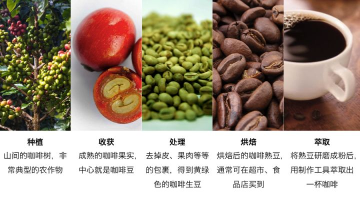
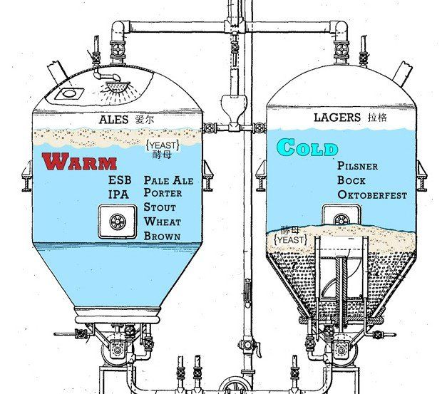
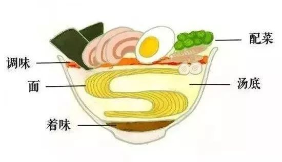
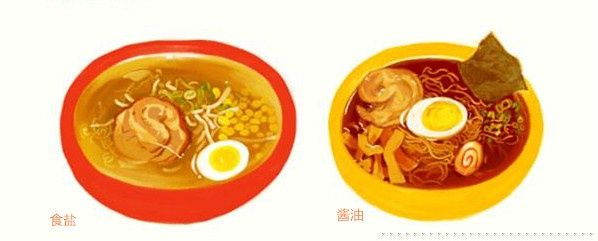
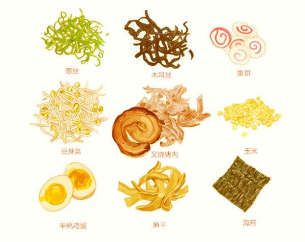
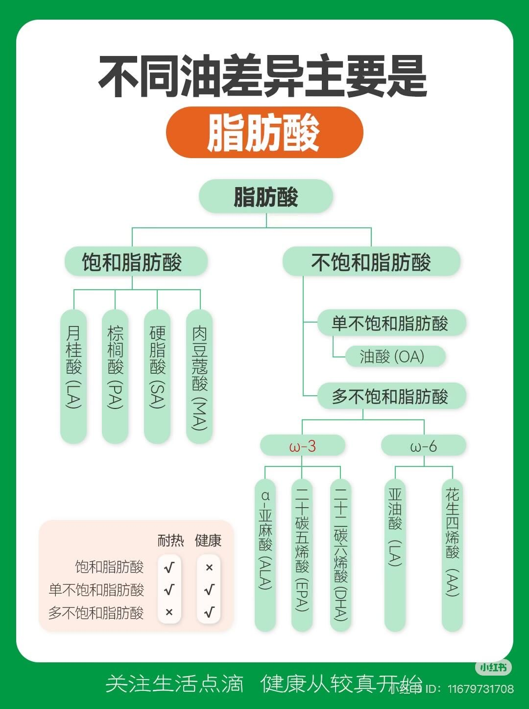

# 一些饮料与食物

这篇笔记收集了烈酒、鸡尾酒、茶、咖啡、啤酒、黄酒、日式拉面和食用油的入门知识。

* 创建时间：2019-02-07
* 更新时间：2024-11-26

## 烈酒与鸡尾酒

### 六大基酒

鸡尾酒常见的六大基酒是金酒、威士忌、白兰地、伏特加、龙舌兰和朗姆酒。苦艾酒等其他酒类也可用来调制鸡尾酒。

| 基酒 | 原料与特点 | 地区或风味印象 |
| --- | --- | --- |
| 金酒 | 以杜松子风味为核心 | 在英国发扬，香气明显，是常用鸡尾酒基酒 |
| 威士忌 | 谷物发酵蒸馏，并经木桶陈酿 | 苏格兰、爱尔兰；带有木桶香气，也常见雪莉桶 |
| 白兰地 | 通常以葡萄或其他水果发酵蒸馏 | 法国干邑、XO 等分类较为常见 |
| 伏特加 | 谷物或马铃薯蒸馏酒 | 常与俄罗斯酒文化联系 |
| 龙舌兰 | 以龙舌兰植物为原料 | 墨西哥代表性烈酒 |
| 朗姆酒 | 以甘蔗或糖蜜为原料 | 与大航海时期的水手文化和贸易史有关 |

### 常见鸡尾酒结构

| 类型 | 基本结构 | 例子或备注 |
| --- | --- | --- |
| Old Fashioned | 烈酒 + 糖浆 + 苦精 + 水或冰 | — |
| Highball | 1 份烈酒 + 2 份长饮 | 金汤力、自由古巴；长饮可用姜汁汽水、汤力水、茶或果汁 |
| Daiquiri | 4 份烈酒 + 2 份柑橘酸 + 1 份糖 | — |
| Sidecar | 1.5 份烈酒 + 1 份柑橘酸 + 1 份利口酒 | 玛格丽特的常见元素包括龙舌兰、君度、柠檬酸和盐 |
| Martini | 8 份烈酒 + 1 份加香葡萄酒 | 加冰时需要控制稀释程度 |
| Flip | 4 份烈酒 + 蛋奶 + 1 份糖 | 原笔记提醒需注意化水程度 |

## 茶

- **绿茶**：不发酵，例如太平猴魁。
- **白茶**：原笔记将其描述为滋味较甜、较淡，常见类型包括白牡丹、贡眉和白毫银针。
- **红茶**：全发酵茶，例如滇红、金骏眉和正山小种。正山小种常带有烟熏香。
- **乌龙茶**：半发酵茶，常见类型包括东方美人、凤凰单丛、岩茶和铁观音，发酵程度和香型差异较大。
- **普洱茶**：生普和熟普的制作方式不同。原笔记将生普的风味描述为鲜明，熟普则带有渥堆发酵形成的仓香和深红汤色。

## 咖啡

<figure markdown="span">
  { loading=lazy }
  <figcaption>咖啡从种植到萃取的流程</figcaption>
</figure>

### 1. 种植

咖啡可按产地、细分地区、庄园或树种分类。原笔记列出了肯尼亚、巴拿马和埃塞俄比亚等产地，以及耶加雪菲、西达摩、蓝山和苏门答腊等更细致的地域名称。

常见大类包括罗布斯塔和阿拉比卡；阿拉比卡之下还有黄波旁、铁皮卡和瑰夏等品种。

### 2. 处理

处理是去除咖啡果肉、得到咖啡生豆的过程。

- **日晒**：通过晾晒处理，可以粗放操作，也可以精细控制；常呈现较明显的水果风味。
- **水洗**：工序相对复杂，原笔记将其风味概括为果酸较明显。
- **蜜处理**：介于日晒与水洗之间的处理思路。

### 3. 烘焙

烘焙是将黄绿色咖啡生豆转变为烘焙豆的过程，常见程度包括浅烘、中烘和深烘。

### 4. 萃取

常见方式包括意式浓缩咖啡（espresso）、滴滤或手冲和虹吸式等。

参考资料：[咖啡豆知识讨论](https://www.zhihu.com/question/22311781)

## 精酿啤酒

啤酒的早期酿造可以追溯到美索不达米亚等地区。含糖汁液与酵母可以形成发酵饮料，后来啤酒花为啤酒带来了独特香气。原笔记特别提到英国、法国、荷兰和比利时等欧洲地区的啤酒传统。

### 艾尔与拉格

- **艾尔（Ale）**：上发酵啤酒，原笔记将其概括为酵母在麦芽汁上部发酵。
- **拉格（Lager）**：下发酵啤酒，使用低温发酵和熟成过程；工业化后更容易控制温度并扩大产量。

<figure markdown="span">
  { loading=lazy }
  <figcaption>艾尔与拉格发酵方式示意图</figcaption>
</figure>

### 几种经典啤酒

- **IPA（India Pale Ale）**：传统配方中使用较多啤酒花，啤酒花风味明显。
- **波特与世涛**：使用深色或烘烤麦芽，常带有焦香。
- **比利时修道院啤酒**：原笔记列举了 Rochefort、Orval、Chimay 和 Westmalle 等品牌。

参考资料：[啤酒种类讨论](https://www.zhihu.com/question/20836356)

## 黄酒

1. 黄酒属于粮食酒，酿造中会使用麦曲。
2. 原笔记将黄酒与中国早期的酒类史联系，并记载了南宋南迁后绍兴鉴湖地区的黄酒发展，以及蒸馏技术传入后白酒的产生。这部分历史表述待进一步核实。
3. 常见分类：
    - **元红**：含糖量较低，在浙江地区较常见。
    - **加饭**：主流黄酒类型之一，常见“花雕”等名称，状元红和女儿红也常与此类联系。
    - **善酿**：使用已酿成的黄酒代替部分水进行酿造，以保留较多糖分。
    - **香雪**：使用糟烧白酒等代替部分水进行酿造，成品的糖分较高。
4. 原笔记认为，品质较好的绍兴黄酒可以凉饮或冰饮；温度会影响香气物质的挥发速度。
5. 黄酒的焦黄色可能与酿造中的氧化反应以及焦糖色的使用有关，原笔记对此保留疑问。
6. 古越龙山等品牌采用机械化生产，原笔记认为其风味表现可接受。

## 日式拉面

<figure markdown="span">
  { loading=lazy }
  <figcaption>日式拉面的基本组成</figcaption>
</figure>

### 1. 面

面条一般可分为生面和干面。生面含水，口感弹韧，煮后不易迅速变软；干面由生面脱水制成，口感也较硬。

### 2. 汤底

常见汤底包括鸡骨、猪骨和海鲜：鸡骨汤较清爽，猪骨汤较浓郁，海鲜汤风味较重。

### 3. 着味

<figure markdown="span">
  { loading=lazy }
  <figcaption>盐味与酱油拉面示意图</figcaption>
</figure>

- **盐味**：风味较清爽。
- **酱油**：变化较多，可分为浓口酱油和淡口酱油，在日本较为常见。
- **味噌**：味道较浓，可能遮盖部分汤底风味。

### 4. 配菜

<figure markdown="span">
  { loading=lazy }
  <figcaption>日式拉面的常见配菜</figcaption>
</figure>

### 5. 调料

参考资料：[日式拉面构成说明](https://zhuanlan.zhihu.com/p/26803986)

## 食用油

下列内容是原笔记对食用油的简要归纳，不作为个人化的健康或饮食建议。

- 饱和脂肪酸通常较耐热，常见于动物油脂等食材。
- 不饱和脂肪酸的类型较多，耐热性与营养特征需要根据具体脂肪酸构成判断。
- 原笔记将橄榄油和山茶油列为单不饱和脂肪酸含量较高的食用油。
- 选购橄榄油时，可关注“特级初榨”（extra virgin）标识。

<figure markdown="span">
  { loading=lazy }
  <figcaption>不同脂肪酸类型示意图（原图含来源水印）</figcaption>
</figure>
