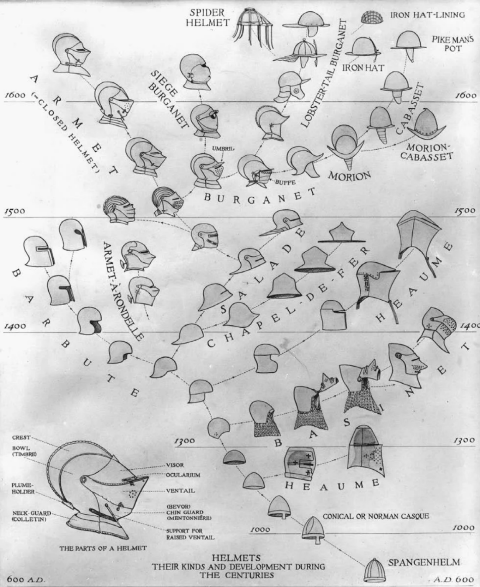
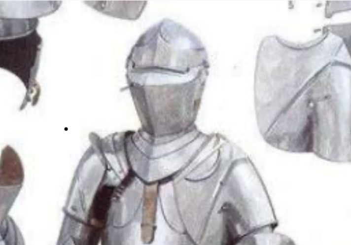
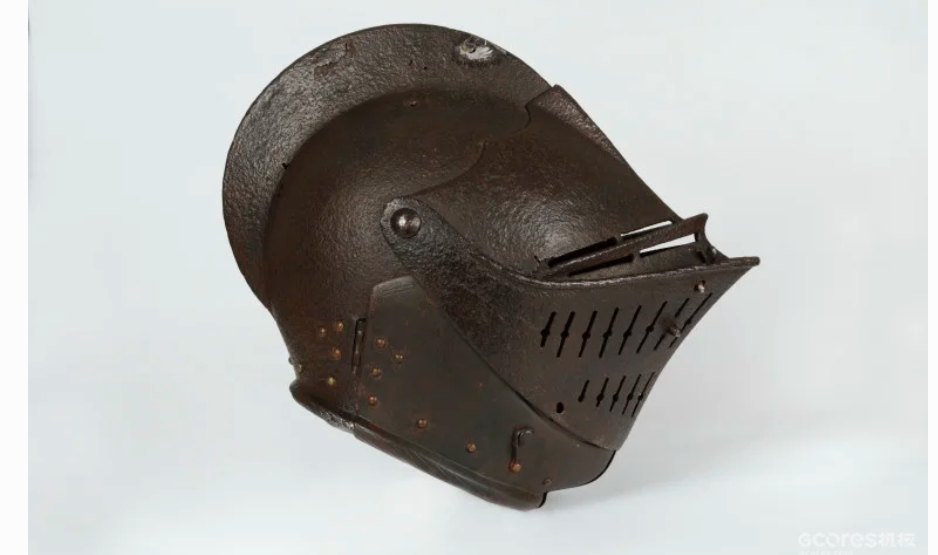

# 中世纪盔甲

*记录时间：2025 年 6 月 9 日*

## 头盔

<figure markdown="span">
  { loading=lazy }
  <figcaption>中世纪头盔类型与发展示意图</figcaption>
</figure>

### 巴斯内特头盔（中头盔）

- **猪面盔**：鼻子尖。
- **犬面盔**：鼻子圆。
- **格里芬盔（roaHelmet）**：比较像巨盔，艺术图好看。
- **巴布塔盔**：斯巴达 Y 形盔外面加一个类似巨盔正脸的面罩，放下来与格里芬盔基本一样。

### 夏雷尔盔与武装盔

- **哥特盔／夏雷尔盔（Sallet）**：正面圆形罩子有一道缝，后面带个小虾尾，丑的一批。
- **米兰盔／武装盔（Armet）**：由犬面盔发展而来，鼻子处呈棱形外延再收回。

<figure markdown="span">
  { loading=lazy }
  <figcaption>米兰盔与武装盔示意图</figcaption>
</figure>

### 格林威治盔

格林威治盔又名船盔，由武装盔衍化而来。造型精致，面罩曲线像船脊一样向内凹。

<figure markdown="span">
  { loading=lazy }
  <figcaption>格林威治盔，也称船盔</figcaption>
</figure>

### 头盔的大致年代

| 类型 | 大致年代 | 主要世纪 |
| --- | ---: | :---: |
| 十字军巨盔 | 1200—1300 年 | 13 世纪 |
| 巴斯内特头盔 | 1300—1450 年 | 14 世纪 |
| 水壶盔 | 1300—1450 年 | 14 世纪 |
| 夏雷尔盔、武装盔 | 1400—1600 年以后 | 15 世纪起 |

## 甲胄发展时间

| 类型 | 大致出现时间 |
| --- | ---: |
| 链甲 | 900 年起 |
| 棉甲武装衣 | 1000 年起 |
| 板甲衣与板甲部件 | 1300 年前后起 |
| 板甲 | 1370 年起 |
| 全身板甲 | 1400 年起 |
| 高订全身板甲 | 1450 年起 |

## 全身板甲

### 米兰板甲

肩甲不对称，左大右小；通常由绑带固定胸甲和腹甲。

### 哥特板甲

发源于意大利，后来传入德国。常配夏雷尔盔，表面有开槽皱纹（fluting），鞋尖尖，通常由铆钉固定胸腹板甲。后期发展成马克思米兰板甲。

### 格林威治板甲

英国铸造的文艺复兴早期板甲，使用镀铜装饰雕花，风格华丽，偏向非实战用途。

## 参考资料

- [机核：中世纪盔甲 2](https://www.gcores.com/articles/20248)
- [欧洲板甲发展史（图片和名称）](https://b23.tv/RErAZlN)
- [零基础辨认中世纪骑士年代](https://b23.tv/TMDqlCf)
