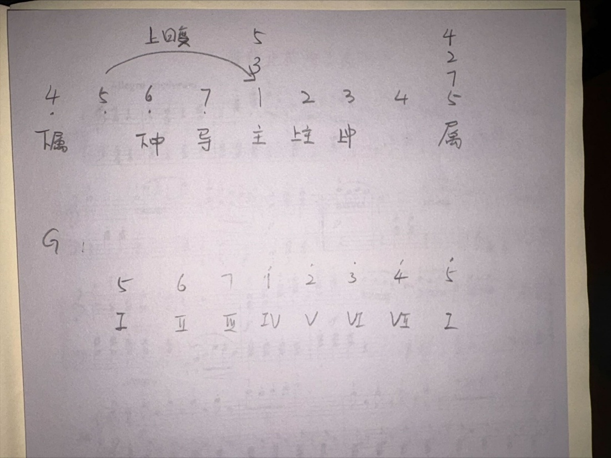

# 乐理

这篇笔记整理了调性、和弦功能、常见和弦进行与织体的基础概念，主要使用简谱数字记法。

* 记录时间：2024-10-08

## 调性

### 大调调号

- 升号调顺序：`4 1 5 2 6 3 7`。根据当前数字向下移动一个音确定调性，例如 `4` 对应 G 大调。
- 降号调顺序：`7 3 6 2 5 1 4`。根据上一个数字确定调性，例如 `5` 对应降 D 大调。
- C 大调和 F 大调需要单独记忆；F 大调只有一个降 `7`。

### 关系小调

关系大调与关系小调在五线谱中共用同一组调号。

- 将当前大调的主音向下移动 3 个半音，可找到关系小调的主音。例如，降 D 大调的关系小调是降 B 小调。
- 小调的第 7 音可向上升高半音。
- 小调音阶的音程结构记作：全、半、全、全、半、全、全。

### 调内琶音

- 主三琶音：`1 3 5`
- 属七琶音：`5 7 2 4`
- 减七琶音：从关系小调的主音向下移动半音作为根音，再按相隔两级的方式向上叠置。

<figure markdown="span">
  { loading=lazy }
  <figcaption>调内和弦功能的手写示意图</figcaption>
</figure>

## 和弦进行

### 基本原则

- 开头和结尾通常优先考虑主和弦。
- 常见四度进行包括 `2-5`、`3-6`、`6-2`和 `5-1`。
- 经典进行之一是 `4-5-3-6-2-5-1`。
- `1`、`4`、`5` 级是稳定的大三和弦；`2`、`3`、`6` 级是小三和弦；`7` 级通常是减三和弦。
- 可以用“`1 3 5` 不论，`2 4 6` 分明”辅助记忆。
- 使用 `5` 级结尾时，可先从 `5sus4`（`5 1 2`）过渡到 `5`（`5 7 2`）。

### 和弦功能

- **大调**：`1` 级为主功能；`3`、`6` 级的氛围较接近主功能；`2`、`4` 级属于下属功能组；`5` 级为属功能。
- **小调**：`1` 级为主功能；`2`、`4`、`6` 级可视为下属功能组；`5` 级为属功能。`3`、`7` 级的用法需根据和声小调等具体语境判断。

### 重属和弦与离调和弦

当和弦从一个主音走向其他目标和弦时，可在中间加入“目标和弦的属和弦”来加强倾向性。例如，`2-5` 之间可加入 `2 #4 6`，`1-4` 之间可加入 `1 3 5 ♭7`。

- `4` 的重属：`1 3 5 ♭7`，可用于 `4-5-3-6-2-5-1` 到 `4` 的衔接。
- `5` 的重属：`2 #4 6 1`，可用于 `4-5` 或 `2-5` 的衔接。
- `6` 的重属：`3 #5 7 2`。
- `7` 的重属：`4 ♭6 1 2`，原笔记尚未完全掌握。
- 原笔记中的“`1` 重属”记为 `5 ♭7 2 4`，用来帮助 `4` 级建立 `2-5-1`；该表述标记为待复核。
- `2` 的重属：`6 #1 3 5`。

## 柱式和弦与常见进行

### 柱式和弦

柱式和弦可通过转位使低音线条相邻、连贯，也可使用“上四下三”的方式进行四度连接。如果音域逐渐偏移，可在两侧增加主音将其拉回，例如 A 小调的 `6 1 3 6`。

增四度和弦带有不稳定、诡异的听感，例如 `4 7` 或 `1 #4`。

### 大调常见进行

- 一般不在 `5` 级后直接接 `4` 级或 `2` 级。
- 卡农进行：`1-5-6-3-4-1-2-5`，也可从关系小调角度记为 `6-3-4-1-2-6-2-3`。
- 阳光感较强的 C 大调段落通常从 `1` 级开始。
- 副歌或过门可考虑 `4-5-3-6-2-5-1`，之后再衔接一个含降七音的 `1` 级和弦。
- 主歌或副歌可使用 `1-6-4-5` 或 `1-6-2-5`，可视为卡农进行的简化。
- 语段半终止可从下属功能落到属功能：`2-2-5`，中间的 `2` 使用 `2 #4 6`。

### 小调常见进行

- 忧郁感较强的 A 小调段落通常从 `6` 级或 `3` 级开始。
- 小调中可将部分大三和弦改成小三或减三和弦来营造紧张感，例如将 `5 7 2` 改为 `#5 7 2`。`2` 级的 `7 2 4 6` 本身具有减和弦色彩。
- 小调语段半终止：`4 (2 4 6)-6 (#4 6 1)-5 (3 #5 7)`。
- 小调 `2-5-1`：`2` 级或 `4` 级（`7 2 4 6`）→ `5` 级（`3 5 7`）或 `7` 级（`5 7 2`）→ `1` 级（`6 1 3`）。
- 小调也可使用卡农进行，按 `6-3-4-1-2-6-7-3` 理解。
- 小调下行急进：`1 (6 1 3)-7 (5 7 2)`，或 `5 (5 7 3)-6 (4 6 1)`。

## 常用织体

除柱式和弦、单加双音和分解柱式外，还可使用以下织体：

- 根根三五：`1 1 3 5`
- 根五根三五：`1 5 1 3 5`
- 根五九三五：`1 5 2 3 5`
- 根五根九三：`1 5 1 2 3`。`1 2 3` 连用通常较生硬，更适合 `6 7 1`、`2 3 4` 这类含半音过渡的位置。
- 根五三七十三：`1 5 3 7 6`。原笔记以《烟花易冷》前奏的 `5 2 7 4 3` 为例，认为附加九音、十三音可通过半音关系增加柔和与变化感。
- 七和弦 `drop 2 & 4`：自下而上记作 `5 2 7 4`。

`drop` 和弦通常用于七和弦。`drop N` 表示将从上往下数第 N 个音移到最低音；`drop N & M` 表示将 N 和 M 两个音下移，M 为最低音，N 为次低音。例如，`1 3 5 7` 的 `drop 2` 为 `5 1 3 7`，`drop 2 & 4` 为 `1 5 3 7`。
